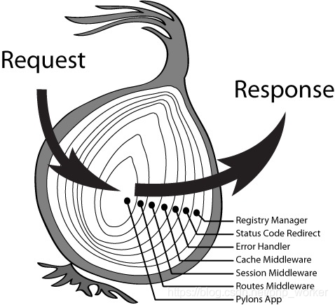

## Express和Koa比较

**Express**

+ 一个基于 Node.js 平台的极简、灵活的 web 应用开发框架。

+ 沿用 Node.js的`Error-First`的模式（第一个参数是error对象）。
+ 集成了路由、静态文件功能模块

**Koa** 

+  Express 幕后的原班人马打造，致力于成为一个更小、更富有表现力、更健壮的 Web 框架。

+ 利用 async 函数，丢弃回调函数.有力地增强错误处理。

+ 不在内核方法中绑定任何中间件，它仅仅提供了一个轻量优雅的函数库，使得编写 Web 应用变得得心应手

### Express和Koa的区别

| 区别       |                       Express                       |                             Koa                              |
| ---------- | :-------------------------------------------------: | :----------------------------------------------------------: |
| 异步方式   |             基于回调， 不会等待异步完成             |   使用async/await解决回调问题，异步完成之后才会执行下一步    |
| 解决错误   |             `Error-First`的模式解决错误             |                 使用 try/catch的方式解决错误                 |
| 集成度     |              集成度高，自带部分中间件               |                      没有捆绑任何中间件                      |
| 中间件模型 |                      线性模型                       | **[洋葱模型](https://segmentfault.com/a/1190000022536602)**  |
| 响应机制   | 立刻响应(res.json/res.send)，上层不能再定义其他处理 | 中间件执行完之后才响应（ctx.body = **），每一层都可以对响应进行自己的处理 |

### 线性模型和洋葱模型

**Express的线性模型：**

使用普通的回调函数，一种线性的逻辑，在同一个线程上完成所有的 HTTP 请求。回调函数对错捕获处理起来很不友好，每一个回调都拥有一个新的调用栈，因此你没法对一个 callback 做 try catch 捕获，你需要在 Callback 里做错误捕获，然后一层一层向外传递。

Koa**的洋葱模型：**

洋葱模型，它的一个特点是级联，通过 await next() 控制调用 “下游” 中间件，直到 “下游” 没有中间件且堆栈执行完毕，最终流回 “上游” 中间件。这种方式有个优点特别是对于日志记录（请求->响应耗时统计）、错误处理支持都很完美。

> 存在一个问题： async/await本质上还是一种链式调用，在链式调用中只能通过await next（）向下传递或者抛出一个错误，但是**无法中断这个链式调用**。

