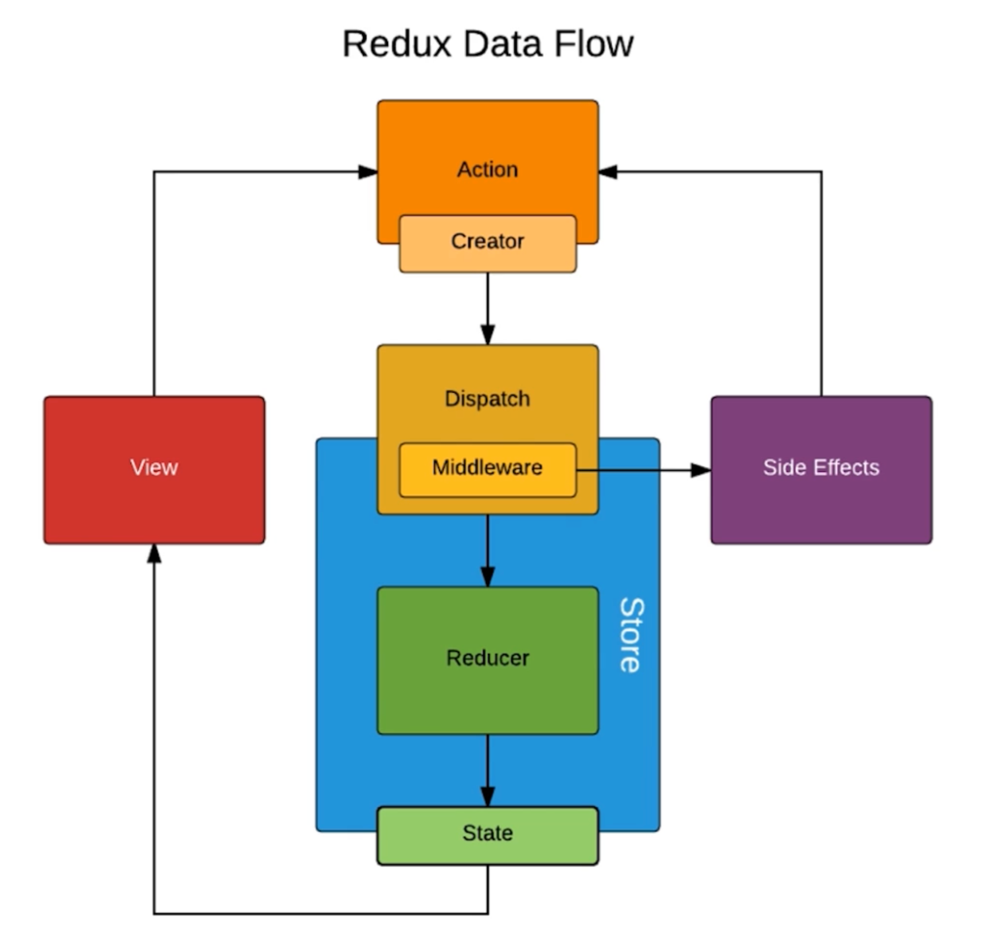
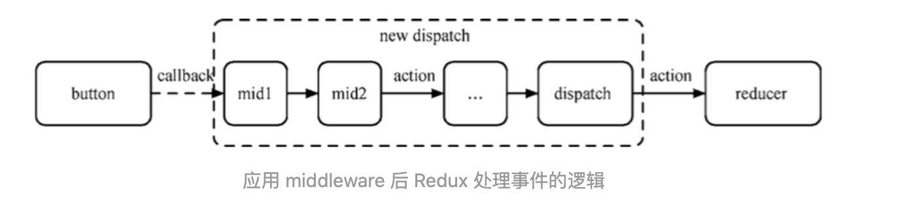
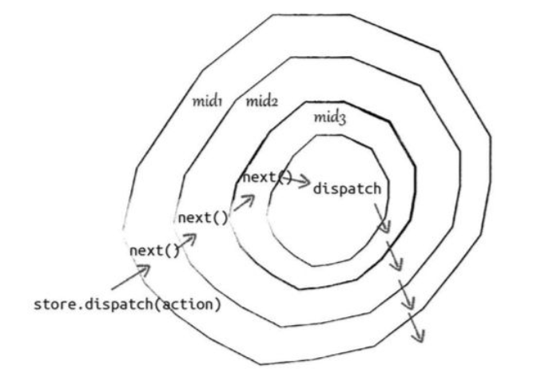

# 介绍


## 三大原则

### 单一数据源

**整个应用的 [state](https://www.redux.org.cn/docs/Glossary.html#state) 被储存在一棵 object tree 中，并且这个 object tree 只存在于唯一一个 [store](https://www.redux.org.cn/docs/Glossary.html#store) 中**


### state 只读

**唯一改变 state 的方法就是触发 [action](https://www.redux.org.cn/docs/Glossary.html#action)，action 是一个用于描述已发生事件的普通对象。**

action的存在使得所有的修改都被集中化处理，且严格按照一个接一个的顺序执行


### 使用纯函数执行修改

**为了描述 action 如何改变 state tree ，你需要编写 [reducers](https://www.redux.org.cn/docs/Glossary.html#reducer)。**


# 基础

 

## State

`Store`对象包含所有数据。如果想得到某个时点的数据，就要对 Store 生成快照。这种时点的数据集合，就叫做 State。

当前时刻的 State，可以通过`store.getState()`拿到。


## Action

[Action](https://www.redux.org.cn/docs/basics/Actions.html) 就是一个 **描述 “要发生什么”**  的普通对象。


**Action** 是把**数据从应用传到 store** 的**有效载荷**。它是 store 数据的唯一来源。

action 是改变 state 的唯一方法， [store.dispatch()](https://www.redux.org.cn/docs/api/Store.html#dispatch) 是发出action的唯一方法， action 传到  store 从而改 变state 状态


### action 使用

action 内必须使用一个 `type` 指定将要执行的动作。 除了 type 以外的字段都可以自定义， 但是我们应该**尽量减少action中传递的数据**。

多数情况下，`type` 会被定义成字符串常量。当应用规模越来越大时，建议使用单独的模块或文件来存放 action。


### Action 创建函数

Redux 中的 action 创建函数只是简单的返回一个 action。这样做将使 action 创建函数更容易被移植和测试。

Redux 中发起dispatch流程：

1. 把 action 创建函数的结果传给 `dispatch()` 方法
2. 创建一个 **被绑定的 action 创建函数** 来自动 dispatch。

```
// action创建函数
function addTodo(text) {
	// 返回一个 action
  return {
    type: ADD_TODO,
    text
  }
}

// 方法1
dispatch(addTodo(text))
// 方法2
const boundAddTodo = text => dispatch(addTodo(text))
```


### store 里面的action

store 里能直接通过 [`store.dispatch()`](https://www.redux.org.cn/docs/api/Store.html#dispatch) 调用 `dispatch()` 方法，但是多数情况下你会使用 [react-redux](http://github.com/gaearon/react-redux) 提供的 `connect()` 帮助器来调用。

[`bindActionCreators()`](https://www.redux.org.cn/docs/api/bindActionCreators.html) 可以自动把多个 action 创建函数 绑定到 `dispatch()` 方法上。


## Reducer

Store 收到 Action 以后，必须给出一个新的 State，这样 View 才会发生变化。这种 State 的计算过程就叫做 Reducer。

**Reducers** 指定了如何 **响应 [actions](https://www.redux.org.cn/docs/basics/Actions.html) 并发送到 store**  的。（没有描述如何更新 state ）


> 开发复杂的应用时，不可避免会有一些数据相互引用。建议你尽可能地把 state 范式化，不存在嵌套。把所有数据放到一个对象里，每个数据以 ID 为主键，不同实体或列表间通过 ID 相互引用数据。把应用的 state 想像成数据库。


### Action处理

**类似于vuex 的 getter 。**


reducer 就是一个纯函数，接收旧的 state 和 action，返回新的 state。reducer 一定要保持纯净，**只要传入参数相同，返回计算得到的下一个 state 就一定相同。**


**永远不要**在 reducer 里做这些操作：

- 修改传入参数；
- 执行有副作用的操作，如 API 请求和路由跳转；
- 调用非纯函数，如 `Date.now()` 或 `Math.random()`。


注意

1. **不要修改 `state`。** 
2. **在 `default` 情况下返回旧的 `state`。**遇到未知的 action 时，一定要返回旧的 `state`。


### 处理多个 Action

​	由于整个应用只有一个 State 对象，包含所有数据，对于大型应用来说，这个 State 必然十分庞大，导致 Reducer 函数也十分庞大。


​		例如： 

```
const chatReducer = (state = defaultState, action = {}) => {
  const { type, payload } = action;
  switch (type) {
    case ADD_CHAT:
      return Object.assign({}, state, {
        chatLog: state.chatLog.concat(payload)
      });
    case CHANGE_STATUS:
      return Object.assign({}, state, {
        statusMessage: payload
      });
    case CHANGE_USERNAME:
      return Object.assign({}, state, {
        userName: payload
      });
    default: return state;
  }
};
```


上面代码中，三种 Action 分别改变 State 的三个属性。

- ADD_CHAT：`chatLog`属性

- CHANGE_STATUS：`statusMessage`属性

- CHANGE_USERNAME：`userName`属性

    

这三个属性之间没有联系，这提示我们可以把 Reducer 函数拆分。不同的函数负责处理不同属性，最终把它们合并成一个大的 Reducer 即可。

```
const chatReducer = (state = defaultState, action = {}) => {
  return {
    chatLog: chatLog(state.chatLog, action),
    statusMessage: statusMessage(state.statusMessage, action),
    userName: userName(state.userName, action)
  }
};
```


上面代码中，Reducer 函数被拆成了三个小函数，每一个负责生成对应的属性。

这样一拆，Reducer 就易读易写多了。而且，这种拆分与 React 应用的结构相吻合：一个 React 根组件由很多子组件构成。这就是说，子组件与子 Reducer 完全可以对应。

#### Reducer 函数合并

​	Redux 提供了一个`combineReducers`方法，用于 Reducer 的拆分。你只要定义各个子 Reducer 函数，然后用这个方法，将它们合成一个大的 Reducer。

```
import { combineReducers } from 'redux';

const chatReducer = combineReducers({
  chatLog,
  statusMessage,
  userName
})

export default todoApp;
```


#### Reducer 函数别名合并

这种写法有一个前提，就是 State 的属性名必须与子 Reducer 同名。如果不同名，就要采用下面的写法。

```
const reducer = combineReducers({
  a: doSomethingWithA,
  b: processB,
  c: c
})
```


你可以把所有子 Reducer 放在一个文件里面，然后统一引入。

```
import { combineReducers } from 'redux'
import * as reducers from './reducers'

const reducer = combineReducers(reducers)
```


## Store

store 就是把 action 和 reducer 联系在一起的对象：

- 维持应用的 state；
- 提供 [`getState()`](https://www.redux.org.cn/docs/api/Store.html#getState) 方法获取 state；
- 提供 [`dispatch(action)`](https://www.redux.org.cn/docs/api/Store.html#dispatch) 方法更新 state；
- 通过 [`subscribe(listener)`](https://www.redux.org.cn/docs/api/Store.html#subscribe) 注册监听器;
- 通过 [`subscribe(listener)`](https://www.redux.org.cn/docs/api/Store.html#subscribe) 返回的函数注销监听器。


store 是单一的， 如果需要拆分数据处理逻辑， 那么应该使用reducer 组合 而不是创建多个 store 。


### [创建 store](https://www.redux.org.cn/docs/api/createStore.html)

```
import { createStore } from 'redux'
import todoApp from './reducers'
// 第一个参数是reducers， 第二个参数设置数据的初始化
let store = createStore(todoApp, window.STATE_FROM_SERVER)
```

### 监听store中state 改变

用subscribe 去监听 store 中 state 的改变，改变后会触发我们传递给store 的回调函数。

subscribe 函数返回一个 对象， 通过这个对象我们可以取消对 store 的监听。

```
let unsubscribe = store.subscribe(() =>
  callback（）
);

unsubscribe();
```


## 数据流

**严格的单向数据流**是 Redux 架构的设计核心。

这意味着应用中的数据都遵循同样的生命周期，这样设计的好处是能够让应用的数据变得可预测并且容易理解。

同时也鼓励做数据范式化，这样可以避免使用多个且独立的无法相互引用的重复数据。


**1. 调用** [`store.dispatch`](https://www.redux.org.cn/docs/api/Store.html#dispatch)


**2. store 调用 reducer 函数**


**3. 根 reducer 应该把多个子 reducer 输出合并成一个单一的 state 树。**


**4. Redux store 保存了根 reducer 返回的完整 state 树。**

这个新的树就是应用的下一个 state！所有订阅 [`store.subscribe(listener)`](https://www.redux.org.cn/docs/api/Store.html#subscribe) 的监听器都将被调用；监听器里可以调用 [`store.getState()`](https://www.redux.org.cn/docs/api/Store.html#getState) 获得当前 state。


## 搭配 react


### 容器组件和展示组件

|       展示组件 | 容器组件                   |                                    |
| -------------: | :------------------------- | ---------------------------------- |
|           作用 | 描述如何展现（骨架、样式） | 描述如何运行（数据获取、状态更新） |
| 直接使用 Redux | 否                         | 是                                 |
|       数据来源 | props                      | 监听 Redux state                   |
|       数据修改 | 从 props 调用回调函数      | 向 Redux 派发 actions              |
|       调用方式 | 手动                       | 通常由 React Redux 生成            |


大部分组件式展示型组件，但是需要少量容器组件把他们和 redux store 联系在一起。

如果容器组件变得太复杂，那么在组件树中引入另一个容器。

技术上讲可以使用 `store.subscribe` 来编写容器组件。但是不建议这样做，这样无法使用 react redux 带来的性能优化。


### 实现展示组件


### 实现容器组件

容器组件就是使用 [`store.subscribe()`](https://cn.redux.js.org/docs/api/Store.html#subscribe) 从 Redux state 树中读取部分数据，并通过 props 来把这些数据提供给要渲染的组件。

建议使用 React Redux 库的 [`connect()`](https://github.com/reactjs/react-redux/blob/master/docs/api.md#connectmapstatetoprops-mapdispatchtoprops-mergeprops-options) 方法来生成，这个方法做了性能优化来避免很多不必要的重复渲染。


下面的定义是为了 [`connect()`](https://github.com/reactjs/react-redux/blob/master/docs/api.md#connectmapstatetoprops-mapdispatchtoprops-mergeprops-options)  函数做准备的参数

**指定state到props的映射mapStateToProps**

获取容器中要用的 state

```
const mapStateToProps = (state) => {
    return {
        list: state.getIn(['header', 'list'])
    }
}
```


**容器组件分发 action 方式**

与store建立联系，定义函数供容器组件使用

`mapDispatchToProps()` 方法接收 [`dispatch()`](https://cn.redux.js.org/docs/api/Store.html#dispatch) 方法并返回期望注入到展示组件的 props 中的回调方法

```
const mapDispathToProps = (dispatch) => {
	return {
		// 在组件中可以触发这个方法去 dispatch 一个 action
		handleChangePage(page, totalPage, spin) {
			dispatch(actionCreators.changePage(page + 1))
		}
	}
}
```


**将store 和容器组件关联起来**

```
export default connect(mapStateToProps, mapDispathToProps)(ComponentName);
```


经过上面的步骤，就可以在其他地方使用这个容器组件了


### 传入 store

React Redux 组件 [`Provider`](https://github.com/reactjs/react-redux/blob/master/docs/api.md#provider-store) 来 [魔法般的](https://doc.react-china.org/docs/context.html) 让所有容器组件都可以访问 store，而不必显式地传递它


# 高级




## 异步action

dispatch 以后，Reducer 立即算出 State，这叫做同步；dispatch 过一段时间再执行 Reducer，这就是异步。


### 异步 action 创建函数

​	通过使用指定的 middleware，action 创建函数除了返回 action 对象外还可以返回函数。这时，这个 action 创建函数就成为了 [thunk](https://en.wikipedia.org/wiki/Thunk)。

​	当 action 创建函数返回函数时，这个函数会被 [Redux Thunk middleware](https://github.com/reduxjs/redux-thunk) 执行。这个函数并不需要保持纯净；它还可以带有副作用，包括执行异步 API 请求。这个函数还可以 dispatch action，就像 dispatch 前面定义的同步 action 一样。


### Redux-Thunk


#### [原理](https://github.com/zp1112/blog/issues/11)


#### 作用

1. 使得action不仅可以返回action对象，还可以返回一个函数
2. 给action传入一个函数的时候，store 的dispatch 方法会自动传递给这个函数

```使shi y
function fetchData() {
  return (dispatch, getState) => {
    setTimeout(() => {
      dispatch({type: 'test', text: 'haha'});
    }, 1000);
  }
} 

store.dispatch(fetchData)
```


[Thunk middleware](https://github.com/gaearon/redux-thunk) 并不是 Redux 处理异步 action 的唯一方式：

- 你可以使用 [redux-promise](https://github.com/acdlite/redux-promise) 或者 [redux-promise-middleware](https://github.com/pburtchaell/redux-promise-middleware) 来 dispatch Promise 来替代函数。
- 你可以使用 [redux-observable](https://github.com/redux-observable/redux-observable) 来 dispatch Observable。
- 你可以使用 [redux-saga](https://github.com/yelouafi/redux-saga/) 中间件来创建更加复杂的异步 action。
- 你可以使用 [redux-pack](https://github.com/lelandrichardson/redux-pack) 中间件 dispatch 基于 Promise 的异步 Action。
- 你甚至可以写一个自定义的 middleware 来描述 API 请求，就像这个 [真实场景的案例](https://www.redux.org.cn/docs/introduction/Examples.html#real-world) 中的做法一样。


## [中间件 middleware](https://www.redux.org.cn/docs/advanced/Middleware.html)

​	**middleware提供的是位于 action 被发起之后，到达 reducer 之前的扩展点。** 你可以利用 Redux middleware 来进行日志记录、创建崩溃报告、调用异步接口或者路由等


​	Middleware 是一个组合 [dispatch function](https://www.redux.org.cn/docs/Glossary.html#dispatching-function) 的高阶函数，可以让你包装 store 的 `dispatch` 方法来达到你想要的目的。它返回一个新的 dispatch function，通常将异步 actions 转换成 action。


​		多个 middleware 可以被组合到一起使用，形成 middleware 链。其中，每个 middleware 都不需要关心链中它前后的 middleware 的任何信息。

​		每个 middleware 接受 `Store` 的 `dispatch` 和 `getState` 函数作为命名参数。 函数签名是 

```
({ getState, dispatch }) => {
	return (next) => action
}
```

​	

### 如何引入 middleware

#### [`applyMiddleware()`](https://www.redux.org.cn/docs/api/applyMiddleware.html) 

1. 用`createStore`创建的 “纯正” store 只支持普通对象类型的 action，而且会立即传到 reducer 来执行。

2. 用 `applyMiddleware`来套住 `createStore` 时，middleware 可以通过 **包装dispatch 方法**修改 action 的执行，并支持执行 dispatch intent（意图）。

    >  Intent 一般是异步操作如 Promise、Observable 或者 Thunk。

    





```js
createStore(reducers, initState, enhancer)

export default function applyMiddleware(...middlewares) {
  return (createStore) => (reducer, preloadedState, enhancer) => {
    // 正常创建 store
    var store = createStore(reducer, preloadedState, enhancer)
    // 把dispatch 方法存下来
    var dispatch = store.dispatch
    // 中间件列表
    var chain = []

    // 把 getState方法和dispatch方法传给 middleware Api
    var middlewareAPI = {
      getState: store.getState,
      dispatch: (action) => dispatch(action)
    }
    // 将middlewareApi 传给每一个 中间件，得到可执行的中间件函数列表
    chain = middlewares.map(middleware => middleware(middlewareAPI))
    // 包装新的dispatch
    dispatch = compose(...chain)(store.dispatch)
		// 把正常的store和包装过后的dispatch返回出去
    return {
      ...store,
      dispatch
    }
  }
}
```

​		**compose即组合函数，将多个函数组合起来串联执行，一个函数的输出作为另一个函数的输入，一旦第一个函数开始执行，过程就会像多米诺骨牌。**

```
let result = compose(f1, f2, f3, f4)(value)；
// 等价于
let result = f1(f2(f3(f4(value))));
```


### 中间件的用法

1. `createStore`方法可以接受整个应用的初始状态作为参数，那样的话，`applyMiddleware`就是第三个参数了。
2. 中间件是依次执行的，次序不正确可能会导致中间件运行不正确。


