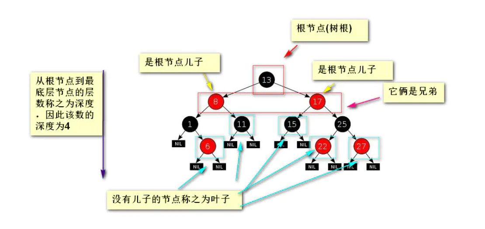
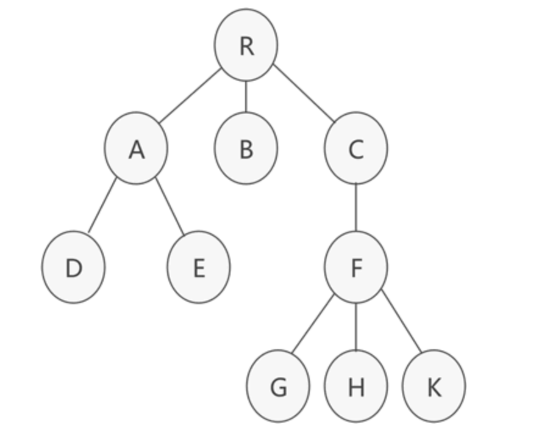
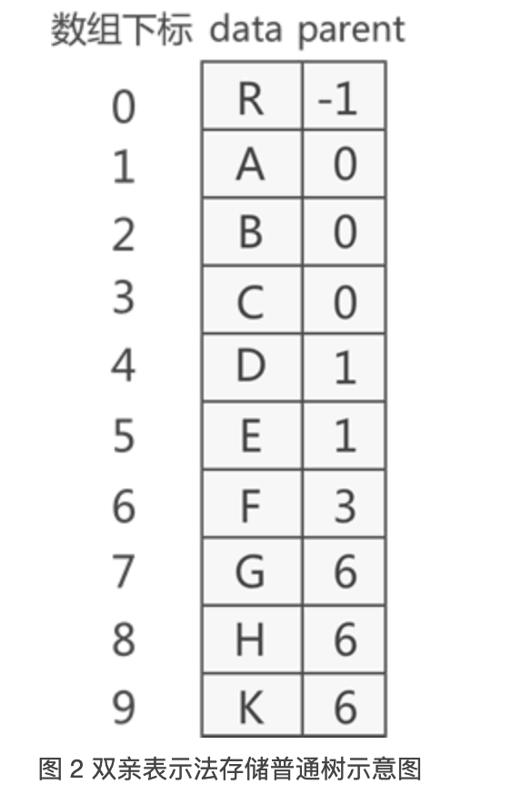
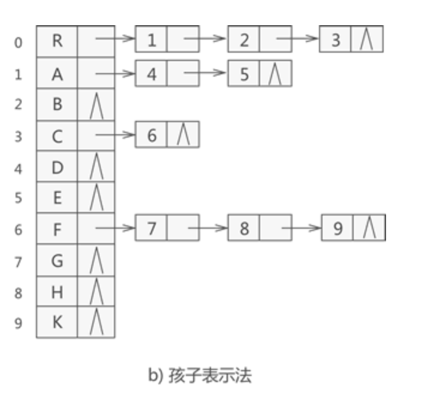

> 参考链接：
>
>  [数据结构概述 (biancheng.net)](http://data.biancheng.net/intro/)
>
> [sisterAn/JavaScript-Algorithms: 基础理论+JS框架应用+实践，从0到1构建整个前端算法体系 (github.com)](https://github.com/sisterAn/JavaScript-Algorithms)


# [复杂度](https://github.com/sisterAn/JavaScript-Algorithms/issues/1)


### 时间复杂度


```
function cal(n) {
    let sum = 0; // 1 unit_time
    let i = 0; // 1 unit_time
    for(; i <= n; i++) { // n unit_time
        sum += i; // n unit_time
    }
    return sum
}
```


这段代码的时间复杂度为  `（2 + 2 ） * n ` 的时间，可以写成

```
T(n) = O(f(n))
```


- n：表示数据规模的大小
- f(n)：表示每行代码执行的次数总和
- O：表示代码的执行时间 T(n) 与 f(n) 表达式成正比

当 n 很大时，例如 10000，甚至更大，`T(n) = O(f(n))` 可以表示为 `T(n) = O(n)` 。

这就是**大 O 时间复杂度表示法**。**大 O 时间复杂度实际上并不具体表示代码真正的执行时间，而是表示代码执行时间随数据规模增长的变化趋势**，所以，也叫作**渐进时间复杂度（asymptotic time complexity）**，简称**时间复杂度**。


#### 时间复杂度分类

**多项式量级：**

- 常量阶： O(1)：当算法中不存在循环语句、递归语句，即使有成千上万行的代码，其时间复杂度也是Ο(1)
- 对数阶：O(logn): 简单介绍一下

```
let i=1;
while (i <= n)  {
  i = i * 2;
}
```

- 每次循环 `i` 都乘以 `2` ，直至 `i > n` ，即执行过程是：20、21、22、…、2k、…、2x、 n
    所以总执行次数 x ，可以写成 2x = n ，则时间复杂度为 O(log2n) 。这里是 `2` ，也可以是其他常量 `k` ，时间复杂度也是： O(log3n) = O(log32 * log2n) = O(log2n)
- 线性阶：O(n)
- 线性对数阶：O(nlogn)
- 平方阶、立方阶、….、k次方阶：O(n2)、O(n3)、…、O(nk)

**非多项式量阶：**

- 指数阶：O(2k)
- 阶乘阶：O(n!)


#### 平均时间复杂度

- 最好时间复杂度：在最理想的情况下，执行这段代码的时间复杂度
- 最坏时间复杂度：在最糟糕的情况下，执行这段代码的时间复杂度
- 平均时间复杂度：所有情况下，求一个平均值，可以省略掉系数、低阶、常量


### 空间复杂度

```
function fun(n) {
    let a = [];
    for (let i = 0; i < n; i++) {
        a.push(i);
    }
    return a;
}
```

以上代码我们可以清晰的看出代码执行的空间为 O(1+n) = O(n)，即为 i 及数组 a 占用的储存空间。

所以，空间复杂度分析比时间复杂度分析要简单很多。


# 数据结构


## [堆栈](https://segmentfault.com/a/1190000019755751)


栈是一个线性表， 可以用数组或者链表实现。遵循 “先进后出的原则” 。插入和删除只能在栈顶进行，基本操作包括 push 和 pop 。


堆是类似树状的数据结构。堆总是一棵完全树。即除了最底层，其他层的节点都被元素填满，且最底层尽可能地从左到右填入


> **最大堆：**若母节点的值恒小于等于子节点的值，此堆称为最小堆（min heap）。
> **最小堆：**若母节点的值恒大于等于子节点的值，此堆称为最大堆（max heap）。
>
> **堆是完全二叉树，完全二叉树不一定是堆**


在 Js 中， 基本数据类型都是存放在栈里面的，引用类型会被放入堆里面，变量中存储的是这个变量在堆里面的引用。


JS 中涉及堆栈的内容有很多： 垃圾回收， 函数执行上下文（函数调用栈）


## 二叉树




### 存储结构

#### 顺序存储

顺序存储指的是使用顺序表（数组）去存储二叉树。

需要注意的是，顺序存储只适用于完全二叉树。如果想要顺序存储普通二叉树，就要自己补全二叉树使它成为完全二叉树。


> 完全二叉树的顺序存储，仅需从根节点开始，按照层次依次将树中节点存储到数组即可。


#### 链式存储

链式存储，则只需从树的根节点开始，将各个节点及其左右孩子使用[链表](http://data.biancheng.net/view/160.html)存储即可。


### 遍历

- 先序遍历
    - 先访问根节点，然后访问左节点，最后访问右节点(根->左->右)
- 中序遍历
    - 先访问左节点，然后访问根节点，最后访问右节点(左->根->右)
- 后序遍历
    - 先访问左节点，然后访问右节点，最后访问根节点(左->右->根)


### 树的表示法



#### [双亲表示法](http://data.biancheng.net/view/196.html)；

双亲表示法采用[顺序表](http://data.biancheng.net/view/158.html)（也就是[数组](http://data.biancheng.net/view/181.html)）存储普通树，其实现的核心思想是：顺序存储各个节点的同时，给各节点附加一个记录其父节点位置的变量。



#### [孩子表示法](http://data.biancheng.net/view/197.html)；

从树的根节点开始，使用顺序表依次存储树中各个节点，需要注意的是，与双亲表示法不同，孩子表示法会给各个节点配备一个链表，用于存储各节点的孩子节点位于顺序表中的位置。



#### [孩子兄弟表示法](http://data.biancheng.net/view/198.html)；


### 哈夫曼树

**哈夫曼树(也称为最优二叉树)就是使 WPL 达到最小的二叉树, 哈夫曼树是带权路径长度最短的树，权值较大的结点离根较近。**


树的带权路径长度规定为所有叶子结点的带权路径长度之和，记为 WPL。即设二叉树有 n 个叶子结点，每个叶子结点带有权值 wk，从根结点到每个叶子的长度为 lk,则每个叶子结点的带权路径长度之和：WPL = ∑wi*li (i = 0,1,2...n)


