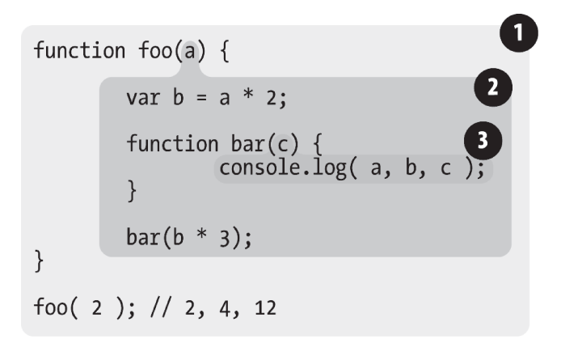

# 作用域


### 编译原理

js 通常被归类为 “解释性语言”。但是实际上js是编译型语言，但是他和其他的编译型语言不一样，它并不会提前编译，他是到了浏览器端才会编译的。


**编译步骤**

1. 分词

2. 解析

    像 `var a = 2`这样一个语句，js引擎会将它转化成一个***抽象语法树（AST）***。这个树的顶级节点是VariableDeclaration（var），接下来是一个Identifier（a）和一个NumericLiteral（2）的子节点。

3. 代码生成


### 理解作用域

有三个相关的概念

- 引擎： js程序的编译和执行

- 编译器： 语法分析/代码生成等

- 作用域

    收集并维护所有声明的标识符组成的一系列查询，确定当前代码对这些标识符的访问权限


当执行`var a = 2` 这一简单的操作时，

1. 遇到 var a，编译器会询问作用域是否已经有一个该名称的变量存在于同一个作用域的集合中。如果是，编译器会忽略该声明，继续进行编译；否则它会要求作用域在当前作用域的集合中声明一个新的变量，并命名为 a。

2.  接下来编译器会为引擎生成运行时所需的代码，这些代码被用来处理 a = 2 这个赋值操作。引擎运行时会首先询问作用域，在当前的作用域集合中是否存在一个叫作 a 的变量。如果是，引擎就会使用这个变量；如果否，引擎会继续查找该变量（查看 1.3节）。

    

如果引擎最终找到了 a 变量，就会将 2 赋值给它。否则引擎就会举手示意并抛出一个异常！


#### 引擎寻找变量


引擎查找变量的两种方式：

1. **LHS** ：左侧查找

    ​	`a = 2` 这段代码是一个 LHS 引用查找，不关心当前的值，只想为 `= 2` 寻找一个目标。关心目标

2. **RHS**： 右侧查找

    `console.log(a)` 这段代码对 a 的引用是一个 RHS 引用，因为 a 并没有赋予任何值。关心当前值


**为什么要区分**

当变量还未声明，这两种查找会导致截然不同的行为。参考以下代码：

```
function foo(a) {
 console.log( a + b );
 b = a;
}
foo( 2 );
```

当`console.log(a+b)`对 b 进行RHS 查找时，找不到 b 会导致一个引用错误。

若没有console.log, 当`b = a` 对 b 进行LHS 查找时，找不到 b 会继续向上查找，直到全局作用域，全局作用域没有，会自动为你创建。


#### 作用域嵌套

当一个块或者函数嵌套在其他的块中时，就会产生作用域嵌套。

**引擎从当前的执行作用域开始查找变量，如果找不到，就向上一级继续查找。当抵达最外层的全局作用域时，无论找到还是没找到，查找过程都会停止。**


# 词法作用域

词法作用域是由你在写代码时将变量和块作用域写在哪里来决定的，因此当词法分析器处理代码时会保持作用域不变（大部分情况下是这样的）。



无论函数在哪里被调用，也无论它如何被调用，他的词法作用域都只由函数被声明的位置决定。

嵌套的作用域可以定义同名变量，这样查找的时候再第一次找到对应变量的时候就会停止。


### 欺骗词法


我们知道函数的词法作用域定义时就已经确定，那我们要修改词法作用域该怎么办呢？

有两种机制实现，但是我们应该**避免使用**它们！

> 欺骗词法作用域会导致性能下降。

1. #### eval

    `eval`可以在你写的代码中用程序生成代码并运行，就好像代码是写在那个位置的一样。

2. #### with

    


### 性能


js 在编译的时候会进行各种优化，以便于在查找作用域的时候能够根据代码位置进行快速的查找到标识符的位置。

如果在代码中发现了 eval 或者 with ，那么所有的优化都毫无意义，这会导致性能大幅下降。


# 函数作用域和块作用域


