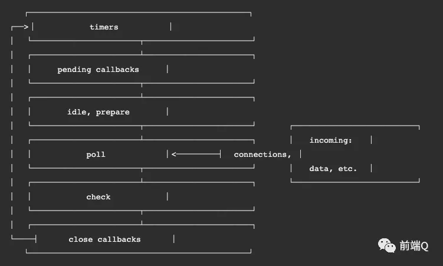
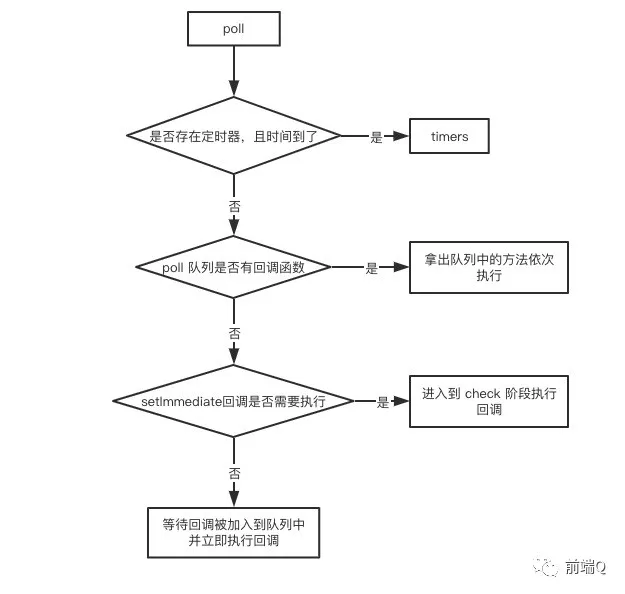

### [node事件循环](https://mp.weixin.qq.com/s/QgfE5Km1xiEkQqADMLmj-Q)

> 参考链接： https://mp.weixin.qq.com/s/QgfE5Km1xiEkQqADMLmj-Q

输入数据阶段(incoming data)->轮询阶段(poll)->检查阶段(check)->关闭事件回调阶段(close callback)->定时器检测阶段(timers)->I/O事件回调阶段(I/O callbacks)->闲置阶段(idle, prepare)->轮询阶段...

- 定时器检测阶段(timers)：本阶段执行setTimeout、setInterval 里面的回调函数。
- I/O事件回调阶段(I/O callbacks)：执行延迟到下一个循环迭代的 I/O 回调
- 闲置阶段(idle, prepare)：仅系统内部使用。
- 轮询阶段(poll)：检索新的 I/O 事件;执行与 I/O 相关的回调（几乎所有情况下，除了关闭的回调函数，那些由计时器和 setImmediate() 调度的之外），其余情况 node 将在适当的时候在此阻塞。
- 检查阶段(check)：setImmediate() 回调函数在这里执行
- 关闭事件回调阶段(close callback)：一些关闭的回调函数，如：socket.on('close', ...)。

#### 三个重点阶段

node中的大部分异步任务都是在poll、check、timers 这三个阶段完成的

##### 轮询（poll）

##### 定时器检测（timer）

执行setTimeout、setInterval定时器

##### 检查（check）

这是一个比较简单的阶段，直接执行setImmediate函数

#### setImmediate/setTimeout/ process.nextTick()

**process.nextTick()最快**

setTimeout()回调与 setImmediate()都会在事件循环的下一个迭代中运行

 `process.nextTick()` 的回调会在事件循环的当前迭代中（当前操作结束之后）被执行。 这意味着它会始终在 `setTimeout` 和 `setImmediate` 之前执行。

[**setTimeout()与 setImmediate()**](https://github.com/LuckyWinty/fe-weekly-questions/issues/41#issuecomment-592047478) 

- setImmediate 设计在poll阶段完成时执行，即check阶段；
- setTimeout 设计在poll阶段为空闲时，且设定时间到达后执行，**但它在timer阶段执行**

setTimeout()与 setImmediate()执行顺序不确定， 因为setTimeout设置为0也需要1ms才能执行（浏览器是4ms），而event loop的启动从timer。

1.  i/o 到 poll 时间有可能大于1ms，如果大于1ms，这时 timeout是1ms，已经符合执行条件settimeout会立即执行，然后接着执行check阶段的setImmediate。
2. 如果event loop启动后到了poll阶段，耗时小于1ms，比如用了 0.8ms,那么这是 settimeout是1ms，符合条件跳到check阶段先执行setImmediate，然后再执行setTimeout

#### [node11前后版本差异](https://mp.weixin.qq.com/s/QgfE5Km1xiEkQqADMLmj-Q)

#### node和浏览器对比

> 浏览器中的微任务是在每个相应的宏任务中执行的，而nodejs中的微任务是在不同阶段之间执行的。

