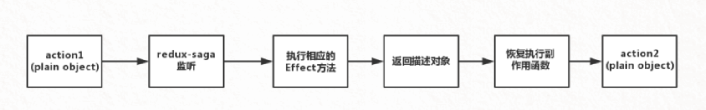

# 基础概念


`redux-saga` 是一个用于管理应用程序 Side Effect（副作用，例如异步获取数据，访问浏览器缓存等）的库。

​		不同于redux-thunk， redux-thunk 是有可能遇到回调地狱的，但是 redux-saga 使用的是generator 进行异步的管理，所以不会遇到回调地狱。


**优点：**

- 集中处理了所有的异步操作，异步接口部分一目了然
- `action`是普通对象，这跟`redux`同步的`action`一模一样
- 通过`Effect`，方便异步接口的测试
- 通过`worker` 和`watcher`可以实现非阻塞异步调用，并且同时可以实现非阻塞调用下的事件监听
- 异步操作的流程是可以控制的，可以随时取消相应的异步操作




## saga使用流程


1. 定义一个sagas.js存放 saga 异步函数。 必须返回一个 generator 函数
2.  在store 中引入 createSagaMiddleware 函数，执行这个函数创建saga中间件。然后在createStore 中使用这个中间件。最后还要调用创建出来的 saga中间件的 run（） 方法
3. 在saga.js中去定义自己的异步函数。 首先监听action， 监听到action之后执行自定义的处理函数， 处理完成时候调用 yield put 发起自己的action 给reducer 函数去改变state状态。


```
1. saga中并没有传递dispatch和getState 方法到中间件中. 在saga中要发action 要通过saga helper 中的 put 方法

2. saga中处理异步采用的是 generator 函数的写法， promise 和 async/await 是不适用的

3. 可以直接在generator 函数之中进行 try-catch 处理异常
```

‘

## 使用 saga helpers


发出异步 action的一个任务

```
import { call, put } from 'redux-saga/effects'

export function* fetchData(action) {
   try {
      const data = yield call(Api.fetchUser, action.payload.url);
      yield put({type: "FETCH_SUCCEEDED", data});
   } catch (error) {
      yield put({type: "FETCH_FAILED", error});
   }
}
```


### takeEvery

允许多个异步action 同时启动

```
import { takeEvery } from 'redux-saga'

function* watchFetchData() {
  yield* takeEvery('FETCH_REQUESTED', fetchData)
}
```


### takeLatest

获得最新的一个任务的响应。

takeLatest 只允许一个任务执行，并且这个任务是最后启动的那个，最后启动的任务回取消掉前面的任务。

```
import { takeLatest } from 'redux-saga'

function* watchFetchData() {
  yield* takeLatest('FETCH_REQUESTED', fetchData)
}
```


### 合并多个Effect

```
import { takeEvery } from 'redux-saga/effects'

// FETCH_USERS
function* fetchUsers(action) { ... }

// CREATE_USER
function* createUser(action) { ... }

// 同时使用它们
export default function* rootSaga() {
  yield takeEvery('FETCH_USERS', fetchUsers)
  yield takeEvery('CREATE_USER', createUser)
}
```


## 声明式 Effects

​		在 `redux-saga` 中，Sagas 都用 Generator 函数实现。

​		我们从 Generator 里 **yield 纯 JavaScript 对象以表达 Saga 逻辑**。 我们称呼那些对象为 ***Effect***。

​		Effect 是一个简单的对象，这个对象包含了一些给 middleware 解释执行的信息，发送给 middleware 的指令以执行某些操作 


​	`redux-saga` 中监听到了原始`js`对象`action`，并不会马上执行副作用操作，会先通过 **`Effect`方法将其转化成一个描述对象**，然后再将描述对象，作为标识，再恢复执行副作用函数


### [声明式 Effect API](https://redux-saga.js.org/docs/api/#effect-creators)

#### take

监听action， 返回监听到的action 对象


```
dispatch({
	type: 'login'
})

// saga
const action = yield take('login')
```


#### call

`call`方法调用`fn`，参数为`args`，返回一个描述对象。

这里`call`方法传入的函数`fn`可以是普通函数，也可以是`generator`。

`call` Effect 的情况中，middleware 会暂停 Generator，直到返回的 Promise 被 resolve。

`call`方法应用很广泛，在`redux-saga`中使用异步请求等常用`call`方法来实现

```
yield call(fetch,'/userInfo',username)
```


#### put

​		对应 redux 中的 dispatch， `redux-saga`执行副作用方法转化`action`时，`put`可以发出`action`，并且被`reducer`监听到从而改变 state 的状态

```
yield put({type:'login'})
```


#### select

对应 redux 中的 getState（）， 可以在中间件中获取 state

```
const id = yield select(state => state.id);
```


#### takeEvery / takeLatest

`takeEvery('*')`（使用通配符 `*` 模式），我们就能捕获发起的所有类型的 action。


# 高级


## 监听未来 action

`take` 的情况中，它创建另一个命令对象，告诉 middleware 等待一个特定的 action，**暂停 Generator 直到一个匹配的 action 被发起**了。


>  Generator 函数，它不具备 `从运行至完成` 的行为（run-to-completion behavior）


### 与 takeEvery 对比

 `takeEvery` 的情况中，被调用的任务无法控制何时被调用， 它们将在每次 action 被匹配时一遍又一遍地被调用。并且它们也无法控制何时停止监听。

 `take` 的情况中，控制恰恰相反。与 action 被推向任务处理函数不同，Saga 是自己主动拉取action 的。 看起来就像是 Saga 在执行一个普通的函数调用 `action = getNextAction()`，这个函数将在 action 被发起时 resolve。


### take 的参数

- 如果以空参数或 `'*'` 调用 `take`，那么将匹配所有发起的 action。（例如，`take()` 将匹配所有 action）

- 如果它是一个函数，那么将匹配 `pattern(action)` 为 true 的 action。（例如，`take(action => action.entities)` 将匹配哪些 `entities` 字段为真的 action）

    > 注意: 如果 pattern 函数上定义了 `toString`，`action.type` 将改用 `pattern.toString` 来测试。这个设定在你使用 action 创建函数库（如 redux-act 或 redux-actions）时非常有用。

- 如果它是一个字符串，那么将匹配 `action.type === pattern` 的 action。（例如，`take(INCREMENT_ASYNC)`）

- 如果它是一个数组，那么数组中的每一项都适用于上述规则 —— 因此它是支持字符串与函数混用的。不过，最常见的用例还属纯字符串数组，其结果是用 `action.type` 与数组中的每一项相对比。（例如，`take([INCREMENT, DECREMENT])` 将匹配 `INCREMENT` 或 `DECREMENT` 类型的 action）


## 无阻塞调用

​		在等待一个异步任务未完成的时候，如果用户调用了后面的任务，由于异步任务还处于阻塞的状态，后面的任务将不会被执行。


### fork 

​		fork就是一个用于非阻塞调用的effect。当我们fork 一个任务， 这个任务在后台启动，调用者也可以继续它自己的流程，而不会被阻塞。

​		用fork包装action 在后台启动之后，我们获取不到fork任务的结果（因为我们不应该等待它）。 所以我们如果依赖于fork 任务的返回值，我们应该直接在 fork 的任务里面对值进行处理。


```
// 在发出登陆请求的时候，也可以点击登出，而不会被阻塞
function* loginFlow() {
  while(true) {
    const {user, password} = yield take('LOGIN_REQUEST')
    yield fork(authorize, user, password)
    yield take(['LOGOUT', 'LOGIN_ERROR'])
    yield call(Api.clearItem('token'))
  }
}
```


### cancel

​	上面的例子有一个问题： 有可能在请求的时候收到登出请求，我们必须要取消掉fork 中的请求任务


cancel这个effect 就是用于取消fork的。


​	`yield fork` 的返回结果是一个 [Task Object](http://superraytin.github.io/redux-saga-in-chinese/docs/api/index.html#task)。 我们将它们返回的对象赋给一个本地常量 `task`。

- 如果我们收到一个 `LOGOUT` action，我们将那个 task 传入给 `cancel` Effect。 
- 如果任务仍在运行，它会被中止。如果任务已完成，那什么也不会发生，取消操作将会是一个空操作（no-op）。
- 如果该任务完成了但是有错误， 那我们什么也没做，因为我们知道，任务已经完成了。


## 执行多任务


错误写法， 多个任务会顺序执行

```
const users = yield call(fetch, '/users'),
      repos = yield call(fetch, '/repos')
```


正确写法， 多个任务都可以同步执行。

```
const [users, repos] = yield [
  call(fetch, '/users'),
  call(fetch, '/repos')
]
```


`yield` 一个包含 effects 的数组， generator 会被阻塞直到所有的 effects 都执行完毕，或者当一个 effect 被拒绝 （类似promise.all）


## effect 竞赛


### race

`race` effect提供一个·方法，在多个effects之间触发一个竞赛，只获取第一个resolve的任务。

```
function* fetchPostsWithTimeout() {
  const {posts, timeout} = yield race({
    posts: call(fetchApi, '/posts'),
    timeout: call(delay, 1000)
  })

  if (posts)
    put({type: 'POSTS_RECEIVED', posts})
  else
    put({type: 'TIMEOUT_ERROR'})
}
```


## [`yield*` 排序Sagas ](https://redux-saga-in-chinese.js.org/docs/advanced/SequencingSagas.html)


## 取消任务


### 自动取消

1. 在 `race` Effect 中。所有参与 race 的任务，除了优胜者，其他任务都会被取消。
2. 并行的 Effect (`yield [...]`)。一旦其中任何一个任务被拒绝，并行的 Effect 将会被拒绝。在这种情况中，所有其他的 Effect 将被自动取消。


## [并发](https://redux-saga-in-chinese.js.org/docs/advanced/Concurrency.html)


### takeEvery


### takeLatest


