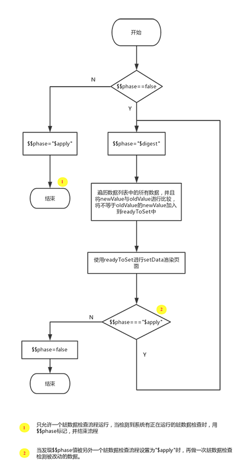

# 快速入门


## [添加项目](https://wepyjs.gitee.io/wepy-docs/1.x/#/?id=添加项目)

`1.7.0` 之后的版本`init`新生成的代码包会在根目录包含`project.config.json`文件，之前生成的代码包可能不存在`project.config.json`文件。 检查根目录是否存在该文件。

如果存在，使用`微信开发者工具`-->`添加项目`，`项目目录`请选择项目根目录即可根据配置完成项目信息自动配置。

如果不存在，建议手动创建该文件后再添加项目。`project.config.json`文件内容如下：

```
{
  "description": "project description",
  "setting": {
    "urlCheck": true,
    "es6": false,
    "postcss": false,
    "minified": false
  },
  "compileType": "miniprogram",
  "appid": "touristappid",
  "projectname": "Project name",
  "miniprogramRoot": "./dist"
}
```

`es6`: 对应`关闭ES6转ES5`选项，关闭。 重要：未关闭会运行报错。

`postcss`: 对应`关闭上传代码时样式自动补全`选项，关闭。 重要：某些情况下漏掉此项也会运行报错。

`minified`: 对应`关闭代码压缩上传`选项，关闭。重要：开启后，会导致真机computed, props.sync 等等属性失效。（注：压缩功能可使用WePY提供的build指令代替，详见后文相关介绍以及Demo项目根目录中的`wepy.config.js`和`package.json`文件。）

`urlCheck`: 对应`不检查安全域名`选项，开启。 如果已配置好安全域名则建议关闭。


# 功能特性


开发模式转换

组件化开发

支持外部加载npm包

单文件模式

默认babel 编译， 支持 promise和 async/ await

优化原生api


# ——————————


# 组件


WePY中的组件都是静态组件，是以组件ID作为唯一标识的，每一个ID都对应一个组件实例，当页面引入两个相同ID的组件时，这两个组件共用同一个实例与数据，当其中一个组件数据变化时，另外一个也会一起变化。需要避免这个问题，则需要分配多个组件ID和实例。

> 父组件`template`模板部分插入驼峰式命名的子组件标签时，不能将驼峰式命名转换成短横杆式命名(比如将`childCom`转换成`child-com`)


```
<template>
    <view class="child1">
        <child></child>
    </view>

    <view class="child2">
        <anotherchild></anotherchild>
    </view>
</template>


<script>
    import wepy from 'wepy';
    import Child from '../components/child';

    export default class Index extends wepy.component {
        components = {
            //为两个相同组件的不同实例分配不同的组件ID，从而避免数据同步变化的问题
            child: Child,
            anotherchild: Child
        };
    }
</script>
```


### 循环渲染

循环渲染WePY组件时(类似于通过`wx:for`循环渲染原生的wxml标签)，必须使用WePY定义的辅助标签`<repeat>`

```
<template>
    <!-- 使用for属性，而不是wx:for属性 -->
    <repeat for="{{list}}" key="index" index="index" item="item">
        <child :item="item"></child>
    </repeat>
</template>
```


### 计算属性&监听器

```
  data = {
      a: 1
  }

  // 在脚本中可通过this.aPlus来引用，在模板中可通过{{ aPlus }}来插值
  computed = {
      aPlus () {
          return this.a + 1
      }
  }
  
   watch = {
      a (newValue, oldValue) {
          console.log(`${oldValue} -> ${newValue}`)
      }
  }
```


### props传值

#### 静态传值

不带引号的直接传值。

父组件向子组件传递常量数据，因此只能传递String字符串类型。


#### 动态传值

动态传值是指父组件向子组件传递动态数据内容，父子组件数据完全独立互不干扰。

可以通过使用`.sync`修饰符来达到父组件数据绑定至子组件的效果，也可以通过设置子组件props的`twoWay: true`来达到子组件数据绑定至父组件的效果。

既使用`.sync`修饰符，同时子组件`props`中添加的`twoWay: true`时，就可以实现数据的双向绑定了。

```
<child 
  :title="parentTitle"
  :syncTitle.sync="parentTitle"
  :twoWayTitle="parentTitle"
></child>

data = {
    parentTitle: 'p-title'
};


// child.wpy

props = {
    // 静态传值
    title: String,

    // 父向子单向动态传值
    syncTitle: {
        type: String,
        default: 'null'
    },

    twoWayTitle: {
        type: Number,
        default: 'nothing',
        twoWay: true
    }
};
```


### 组件通信

`wepy.component`基类提供`$broadcast`、`$emit`、`$invoke`三个方法用于组件之间的通信和交互


用于监听组件之间的通信与交互事件的事件处理函数需要写在组件和页面的`events`对象中

```
export default class Com extends wepy.component {
    components = {};

    data = {};

    methods = {};

    // events对象中所声明的函数为用于监听组件之间的通信与交互事件的事件处理函数
    events = {
        'some-event': (p1, p2, p3, $event) => {
               console.log(`${this.$name} receive ${$event.name} from ${$event.source.$name}`);
        }
    };
    // Other properties
}
```


#### **$broadcast**

由父组件发起，所有子组件都会收到此广播事件，除非事件被手动取消。（广度优先： 从上到下）

#### **$emit**

`$emit`与`$broadcast`正好相反，事件发起组件的所有祖先组件会依次接收到`$emit`事件。

#### **$invoke**

`$invoke`是一个页面或组件对另一个组件中的方法的直接调用，通过传入组件路径找到相应的组件，然后再调用其方法。

```
this.$invoke('ComA', 'someMethod', 'someArgs');

this.$invoke('./../ComB/ComG', 'someMethod', 'someArgs');
```


### 组件自定义事件处理

以通过使用`.user`修饰符为自定义组件绑定事件，如：`@customEvent.user="myFn"`

其中，`@`表示事件修饰符，`customEvent` 表示事件名称，`.user`表示事件后缀。

目前总共有三种事件后缀：

- `.default`: 绑定小程序冒泡型事件，如`bindtap`，`.default`后缀可省略不写；
- `.stop`: 绑定小程序捕获型事件，如`catchtap`；
- `.user`: **标识**绑定用户自定义组件事件，**通过`$emit`触发的事件在这里接收**。`注意，如果用了自定义事件，则events中对应的监听函数不会再执行。`


### slot内容分发插槽

首先在子组件`template`模板部分中声明`slot`标签作为内容插槽，同时必须在其`name`属性中指定插槽名称，还可设置默认的标签内容；

然后在引入了该带有插槽的子组件的父组件`template`模板部分中声明用于“插拔”的内容分发标签。

```
// 组件定义
<view class="panel">
    <slot name="title">默认标题</slot>
    <slot name="content">默认内容</slot>
</view>

// 使用
<panel>
    <view slot="title">新的标题</view>
    <view slot="content">
        <text>新的内容</text>
    </view>
</panel>
```


# Mixin 混入

#### 默认式混入

组件`data`数据，`components`组件，`events`事件以及其它自定义方法采用**默认式混合**，即如果组件未声明该数据，组件，事件，自定义方法等，那么将混合对象中的选项将注入组件这中。对于组件已声明的选项将不受影响。


#### [兼容式混合](https://wepyjs.gitee.io/wepy-docs/1.x/#/?id=兼容式混合)

对于组件`methods`响应事件，以及小程序页面事件将采用**兼容式混合**，即先响应组件本身响应事件，然后再响应混合对象中响应事件。

>  这里事件的执行顺序跟Vue中相反，[Vue中是先执行mixin中的函数， 再执行组件本身的函数](https://vuejs.org/v2/guide/mixins.html#Option-Merging)


# WXS 

1. wxs 是基于原生的wxs去实现的，只是通过编译把现在的语法编译为原生语法。
2. wxs 必须是外链文件。并且后缀为`.wxs`。
3. wxs 引入后只能在 template 中使用，不能在 script 中使用。


```
// mywxs.wxs
module.exports = {
  text: 'This is from wxs',
  filter: function (num) {
    return num.toFixed(2);
  }
};

// index.wpy
<template>
  <text>{{m1.text}}</text>
  <text>{{m1.filter(num)}}</text>
</template>

<script>
  import mywxs from '../wxs/mywxs.wxs';
  export default class Index extends wepy.page {
    data = {
      num: 10
    };

    wxs = {
      m1: mywxs
    }

  };
</script>
```


# interceptor

wepy 提供的全局拦截器， 可以对原生的 api 进行拦截。

```
export default class extends wepy.app {
    constructor () {
        //拦截request请求
        this.intercept('request', {
            // 发出请求时的回调函数
            config (p) {
                // 对所有request请求中的OBJECT参数对象统一附加时间戳属性
                p.timestamp = new Date().getTime();
                console.log('config request: ', p);
                // 必须返回OBJECT参数对象，否则无法发送请求到服务端
                return p;
            },

            // 请求成功后的回调函数
            success (p) {
                // 可以在这里对收到的响应数据对象进行加工处理
                console.log('request success: ', p);
                // 必须返回响应数据对象，否则后续无法对响应数据进行处理
                return p;
            },

            //请求失败后的回调函数
            fail (p) {
                console.log('request fail: ', p);
                // 必须返回响应数据对象，否则后续无法对响应数据进行处理
                return p;
            },

            // 请求完成时的回调函数(请求成功或失败都会被执行)
            complete (p) {
                console.log('request complete: ', p);
            }
        });
    }
}
```


# 数据绑定

## [WePY数据绑定](https://wepyjs.gitee.io/wepy-docs/1.x/#/?id=wepy数据绑定方式)

WePY使用脏数据检查对setData进行封装，在函数运行周期结束时执行脏数据检查，一来可以不用关心页面多次setData是否会有性能上的问题，二来可以更加简洁去修改数据实现绑定，不用重复去写setData方法。

```javascript
this.title = 'this is title';

// 原生小程序
this.setData({title: 'this is title'});
```


**在异步函数中更新数据的时，必须手动调用`$apply`方法**，才会触发脏数据检查流程的运行。如：

```javascript
setTimeout(() => {
    this.title = 'this is title';
    this.$apply();
}, 3000);
```


## [WePY脏数据检查](https://wepyjs.gitee.io/wepy-docs/1.x/#/?id=wepy脏数据检查流程)





# [其他细节优化](https://cloud.githubusercontent.com/assets/2182004/20554709/a0d8b1e8-b198-11e6-9034-0997b33bdf95.png)


1. wx.request 接收参数修改
2. 事件参数传递
3. 数据绑定方式
4. 组件代替模版和模块


