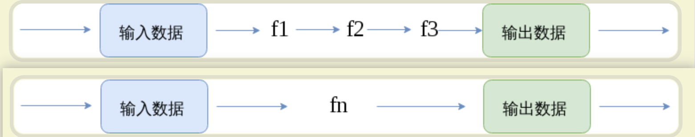

## [编程范式](https://www.cnblogs.com/sirkevin/p/8283110.html)

​		目前主流的编程范式有三种： 命令式编程、 声明式编程、 函数式编程

​		

### 命令式编程

​		关注计算机执行的步骤， **一步一步告诉计算机先做什么再做什么**。 

​		计算机硬件的工作方式基本都是命令式的， 编程语言也基本是基于命令式的。


​		比需要在数组中筛选大于 5 的数字，如果是就将它添加到结果数组。

1. 第一步： 创建结果数组
2. 第二部： 遍历要筛选数组
3. 第三步： 判断是不是大于5， 如果是就将它加入结果集

```
let result = []
for (item in arr ){
	if(item > 5) {
		result.push(item)
	}
}
```


### 声明式编程

​		声明式编程是以数据结构的形式来表达程序执行的逻辑。它的主要思想是**告诉计算机应该做什么，但不指定具体要怎么做**。

​		它描述目标的性质，让计算机明白目标，而非具体过程。声明式编程不用告诉计算机问题领域，从而避免随之而来的副作用。

​		它特点是 

- 它不需要创建变量用来存储数据； 
- 它不包含循环控制的代码如 for， while。


例如 sql 查询（html 和 css 也是声明式编程）

```
SELECT * FROM collection WHERE num > 5
```


### 函数式编程

​		数式编程和声明式编程是有所关联的，因为他们思想是一致的：即**只关注做什么而不是怎么做**。但函数式编程不仅仅局限于声明式编程。

​		函数式编程最重要的特点是“**函数第一位**”，即函数可以出现在任何地方，比如你可以把函数作为参数传递给另一个函数，不仅如此你还可以将函数作为返回值。


​		具体例子可以参考 **[ramda](https://ramda.cn/docs/)**


### 面向对象编程

​		并不是使用类才是面向对象编程， 只要**专注于状态改变和密封抽象**，就是面向对象编程。

​		它分隔构成抽象的结构和行为的元素，描述对象的基本特征， 让我们能够专注于部分的功能， 让代码具有可扩充性和开放性。


## [函数式编程](http://www.ruanyifeng.com/blog/2017/02/fp-tutorial.html)


### 特点

- 与命令式编程和声明式编程并列的编程范式。
- 最主要的特征是，函数是`第一等公民`。
- 强调将计算过程分解成可复用的函数，典型例子就是`map`方法和`reduce`方法组合而成 [MapReduce 算法](https://zh.wikipedia.org/wiki/MapReduce)。
- 只有[纯的](https://zh.wikipedia.org/wiki/纯函数)、没有[副作用](https://zh.wikipedia.org/wiki/函数副作用)的函数，才是合格的函数。


### 函数的合成和柯里化


#### 合成

​		如果一个值要经过多个函数，才能变成另外一个值，就可以把所有中间步骤合并成一个函数，这叫做"函数的合成"（compose）。




#### 柯里化

​		"柯里化"，就是把一个多参数的函数，转化为单参数函数。


```
// 柯里化之前
function add(x, y) {
  return x + y;
}

add(1, 2) // 3

// 柯里化之后
function addX(y) {
  return function (x) {
    return x + y;
  };
}

addX(2)(1) // 3
```


### 函子

​		函数式编程里面的运算，都是通过函子完成，即运算不直接针对值，而是针对这个值的容器----函子。函子本身具有对外接口（`map`方法），各种函数就是运算符，通过接口接入容器，引发容器里面的值的变形。

​		函子首先是一种范畴，也就是说，是一个容器，包含了值和变形关系。**比较特殊的是，它的变形关系可以依次作用于每一个值，将当前容器变形成另一个容器。**

​		**一般约定，函子的标志就是容器具有`map`方法。该方法将容器里面的每一个值，映射到另一个容器。**

​		函子就是一个个的处理方法， 函子之间进行组合、排列、 包含， 对函子使用可以引发容器内的值变形，得到我们想要的结果。函数式编程就变成了运用不同的函子解决实际问题。


## pointfree 编程风格

​		我们完全可以把数据处理的过程，定义成一种与参数无关的合成运算。不需要用到代表数据的那个参数，只要把一些简单的运算步骤合成在一起即可。


### 例子


我们有一个处理问题的函数

```
fn： a -> b
```

如果 fn 逻辑比较复杂，我们会倾向于把它拆开

```
f1 :: a -> m
f2 :: m -> n
f3 :: n -> b
```

这样就多了两个中间值 m 、 n ， 但是我们想要的只是最终的 b

```
fn = R.pipe(f1, f2, f3);
```

这样我们就可以只关注过程， 而不用担心 m、n 对我们的影响， 甚至a 和 b 是什么我们也不需要关注，因为这只是一段处理问题的逻辑。


### 特点


​		**这就叫做 Pointfree：不使用所要处理的值，只合成运算过程。**中文可以译作"无值"风格。

​		Pointfree 就是运算过程抽象化，处理一个值，但是不提到这个值。这样做有很多好处，它能够让**代码更清晰和简练，更符合语义，更容易复用，测试也变得轻而易举**。

​		Pointfree 的本质就是使用一些通用的函数，组合出各种复杂运算。上层运算不要直接操作数据，而是通过底层函数去处理。


## [ramda](https://ramda.cn/)


### 介绍

Ramda 主要特性如下：

- Ramda 强调更加纯粹的函数式风格。数据不变性和函数无副作用是其核心设计理念。这可以帮助你使用简洁、优雅的代码来完成工作。
- Ramda 函数本身都是自动柯里化的。这可以让你在只提供部分参数的情况下，轻松地在已有函数的基础上创建新函数。
- Ramda 函数参数的排列顺序更便于柯里化。要操作的数据通常在最后面。


### [API](https://ramda.cn/docs/)

柯里化函数的参数占位符。允许部分应用于任何位置的参数。

假设 `g` 代表柯里化的三元函数，`_` 代表 `R.__`，则下面几种写法是等价的：

- `g(1, 2, 3)`
- `g(_, 2, 3)(1)`
- `g(_, _, 3)(1)(2)`
- `g(_, _, 3)(1, 2)`
- `g(_, 2, _)(1, 3)`
- `g(_, 2)(1)(3)`
- `g(_, 2)(1, 3)`
- `g(_, 2)(_, 3)(1)`


#### API主要功能

一、比较运算
二、数学运算
三、逻辑运算
四、字符串
五、函数
\-  5.1 函数的合成
\- 5.2 柯里化
\- 5.3 函数的执行
六、数组
\- 6.1 数组的特征判断
\- 6.2 数组的截取和添加
\- 6.3 数组的过滤
\- 6.4 单数组运算
\- 6.5 双数组运算
\- 6.6 复合数组
七、对象
\- 7.1 对象的特征判断
\- 7.2 对象的过滤
\- 7.3 对象的截取
\- 7.4 对象的运算
\- 7.5 复合对象


