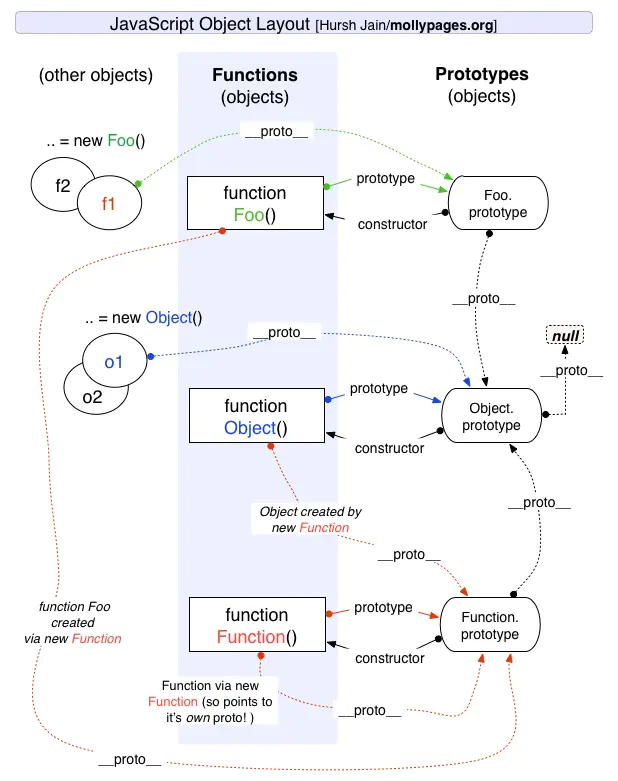
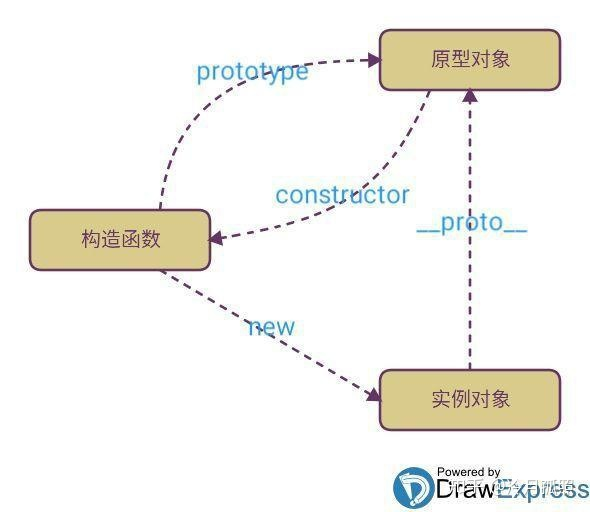
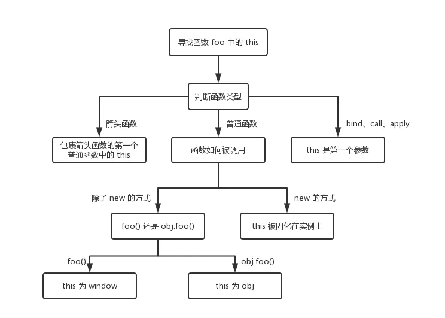
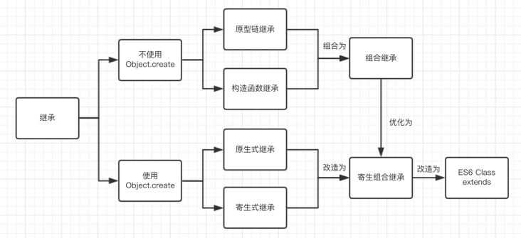

### [原型链](https://segmentfault.com/a/1190000021232132)

>  参考链接  
>
>  [JavaScript深入之从原型到原型链 · Issue #2 · mqyqingfeng/Blog (github.com)](https://github.com/mqyqingfeng/blog/issues/2),
>
> [一张图搞定JS原型&原型链 - SegmentFault 思否](https://segmentfault.com/a/1190000021232132)




#### 基本概念

\__proto\__ 、 prototype和constructor

1. 对象中都有两个属性， \__proto\__ 和constructor
2. prototype 是函数独有的
3. 函数是一种特殊的对象，所以函数同时拥有 \__proto\__ 和constructor 和 prototype




 \__proto__  属性是实例对象指向原型对象的属性

 prototype 属性指向一个对象，这个对象正是调用该构造函数而创建的**实例**的原型。

constructor属性，用于记录实例是由哪个构造函数创建；

原型对象也有一个自己的原型对象(  \___proto\___ ) ，层层向上直到一个对象的原型对象为 null。(根据定义，null 没有原型，并作为这个原型链中的最后一个环节)


#### 四个概念和两个原则

**四个概念**	

1. js分为**函数对**象和**普通对象**，每个对象都有\__proto\__属性，但是只有函数对象才有prototype属性
2. Object、Function都是js内置的**函数**, 类似的还有我们常用到的Array、RegExp、Date、Boolean、Number、String
3. 属性\__proto\__是一个对象，它有两个属性，constructor和\__proto\__；
4. 原型对象prototype有一个默认的constructor属性，用于记录实例是由哪个构造函数创建；


**两个原则**

1. Person.prototype.constructor === Person 

    **准则1：原型对象（即Person.prototype）的constructor指向构造函数本身** 

2. person01.\__proto__ == Person.prototype 

   **准则2：实例（即person01）的__proto__和原型对象指向同一一个地方**


#### 注意事项

instanceof（f1） === Function的返回值是false，因为instanceof会一直沿着__proto__寻找，Foo.prototype.__prpto__ 将直接指Object.propotype.

用function funName（）定义的函数，包括js内置的function Object（）和 function Function() 都属于同一个原型——Function.prototype.

### this的指向问题



- 对于直接调用`foo`来说，不管`foo`函数被放在了什么地方，`this`一定是`window`
- 对于`obj.foo()`来说，我们只需要记住，谁调用了函数，谁就是`this`，所以在这个场景下`foo`函数中的`this`就是`obj`对象
- 对于`new`的方式来说，`this`被永远绑定在了`c`上面，不会被任何方式改变`this`

```
function foo() {
  console.log(this.a)
}
var a = 1

foo()

const obj = {
  a: 2,
  foo: foo
}

obj.foo()

const c = new foo()
```

#### bind/apply/call

这三个函数都可以用来改变this的指向

**bind**返回的是一个函数， call/apply 是立刻执行的

**call** 传入的参数是一系列的参数， **apply** 传入的是一个参数数组


### JS继承


> 参考链接：
>
> https://segmentfault.com/a/1190000016708006
>
> https://segmentfault.com/a/1190000015727237




#### 原型链继承

**原型式继承**

> 通过将子类的原型指向了父类的实例


优点：实现基于一个对象的简单继承，不必创建构造函数

缺点：

1. 创建子类实例时，无法向父类构造函数传参
2. 父类的引用属性会被所有子类实例共享， 实例1修改原型对象上的属性会影响实例2
3. 不能多继承

```
function object(o){  
    function F(){};  
    F.prototype = o;  
    return new F();
}
```

#### 借用构造函数

> 在子类型构造函数中通用call()调用父类型构造函数


**特点：**

- 解决了原型链继承中子类实例共享父类引用属性的问题
- 创建子类实例时，可以向父类传递参数
- 可以实现多继承(call多个父类对象)

**缺点**：

- 实例并不是父类的实例，只是子类的实例
- 只能继承父类的实例属性和方法，不能继承原型属性和方法
- 无法实现函数复用，每个子类都有父类实例函数的副本，影响性能

```
  function Person(name, age) {
    this.name = name,
    this.age = age,
    this.setName = function () {}
  }
  Person.prototype.setAge = function () {}
  function Student(name, age, price) {
  	// 相当于:：this.Person(name, age)
    Person.call(this, name, age) // 不能继承 setAge 方法
    this.price = price
  }
```

#### 组合继承

> 通过调用父类构造，继承父类的属性并保留传参的优点，然后通过将父类实例作为子类原型，实现函数复用。


**优点**：

- 可以继承实例属性/方法，也可以继承原型属性/方法
- 不存在引用属性共享问题
- 可传参
- 函数可复用

**缺点**：

- 调用了两次父类构造函数，生成了两份实例

```
 function Person(name, age) {
 	this.name = name,
 	this.age = age,
 	this.setAge = function () { }
 }
 Person.prototype.setAge = function () {
 	console.log("111")
 }
 function Student(name, age, price) {
 	Person.call(this,name,age)
 	this.price = price
 	this.setScore = function () { }
 }
Student.prototype = new Person()
//组合继承也是需要修复构造函数指向的
Student.prototype.constructor = Student
```


#### 原型式继承

#### 寄生式继承

```
function inheritPrototype(subType, superType){
    var prototype = object(superType.prototype); // 创建了父类原型的浅复制
    prototype.constructor = subType;             // 修正原型的构造函数
    subType.prototype = prototype;               // 将子类的原型替换为这个原型
}

function SuperType(name){
    this.name = name;
    this.colors = ["red", "blue", "green"];
}

SuperType.prototype.sayName = function(){
    alert(this.name);
};

function SubType(name, age){
    SuperType.call(this, name);
    this.age = age;
}
// 核心：因为是对父类原型的复制，所以不包含父类的构造函数，也就不会调用两次父类的构造函数造成浪费
inheritPrototype(SubType, SuperType);
SubType.prototype.sayAge = function(){
    alert(this.age);
}
```


####  寄生组合继承

> 开发人员普遍认为寄生组合式继承是引用类型最理想的继承范式。


### 深拷贝和浅拷贝

拷贝：将一个对象复制一份给新对象

> 浅拷贝： 拷贝前后对象的基本数据类型互不影响，但拷贝前后对象的引用类型因共享同一块内存，会相互影响。

> 深拷贝： 另外创造一个一模一样的对象，新对象跟原对象"完全"不共享堆内存，修改新对象不会改到原对象。

#### 浅拷贝方式

1.  Object.assign()。 把任意多个的源对象自身的可枚举属性拷贝给目标对象，然后返回目标对象。
2.  ... 展开运算符。
3.  slice() 和 concat()。 （针对于数组）
    1. 只是第一层的深拷贝，二级及以下没有影响

#### [深拷贝方式](https://juejin.cn/post/6844904197595332622#heading-13)

1. 递归赋值

   1. 遇到循环引用，会陷入一个循环的递归过程，从而导致爆栈
2. JSON.parse(JSON.stringify())

   1. 忽略undefined、任意的函数、symbol 值、正则表达式，因为JSON.stringify不能识别这些
3. Object.create()

```
function deepClone(obj, hash = new WeakMap()) {
  if (obj === null || obj === undefined) return obj; // 如果是null或者undefined我就不进行拷贝操作
  if (obj instanceof Date) return new Date(obj);
  if (obj instanceof RegExp) return new RegExp(obj);
  if (typeof obj !== "object") return obj;
 
  // 已经遍历过的直接从weakMap中取
  if (hash.get(obj)) return hash.get(obj);
  
  let cloneObj = Array.isArray(obj) ? [] : {};
  hash.set(obj, cloneObj);
  
  for (let key in obj) {
    if (obj.hasOwnProperty(key)) { // 判断key
      cloneObj[key] = deepClone(obj[key], hash);
    }
  }
  return cloneObj;
}
```


### 判断数组的三种方式

Object.prototype.toString.call() 、instanceof 、Array.isArray()

#### Object.prototype.toString.call()

优点： 对于所有基本的数据类型都能进行判断，即使是 null和defined

缺点： 不能判断自定义对象

#### instanceof 

优点： 能够判断自定义对象

缺点： 只能判断对象的类型，原始类型不行

#### Array.isArray

优点： 方便

缺点： 只能判断数组类型。ES5新增，存在兼容性问题，可以用Object.prototype.toString.call()代替。


