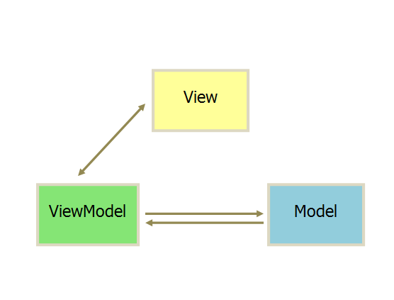

# Vue

### [Vue组件通信](https://juejin.cn/post/6844904048118726663#heading-18)

1. 父子组件通信。 
   1. props 和 $emit
   2. $refs
2. 祖先后代
   1. [provider和inject(依赖注入)](https://vue3js.cn/docs/zh/guide/component-provide-inject.html)
3. 通用
   1. [Vuex](https://vuex.vuejs.org/zh/)
   2. eventBus事件总线

### 如何理解[MVVM](https://juejin.cn/post/6844903825225023502#heading-2)



##### 分层

View 是视图层，也就是用户界面。

Model 是指数据层，泛指后端进行的各种业务逻辑处理和数据操控，主要围绕数据库系统展开。

**MVVM 的核心是 ViewModel （业务逻辑层）**，是由前端开发人员组织生成和维护的视图数据层，它就像是一个中转站（value converter），负责转换 Model 中的数据对象来让数据变得更容易管理和使用，该层向上与视图层进行**双向数据绑定**，向下与 Model 层通过接口请求进行数据交互


##### 优缺点

**优点**

1. 双向绑定
2. 简化了controller
3. 易于维护
4. 易于测试
5. 低耦合，可重用

**缺点**

1. bug难调试。 页面的异常可能来自 M 也可能来自VM
2. 对于大型的图形应用程序，视图状态较多，ViewModel的构建和维护的成本都会比较高。

### [v-for为什么需要key](https://vue3js.cn/docs/zh/guide/list.html#%E7%BB%B4%E6%8A%A4%E7%8A%B6%E6%80%81)

[讨论](https://github.com/Advanced-Frontend/Daily-Interview-Question/issues/1)

使用 v-for渲染的元素列表时，它默认使用“就地更新”的策略。如果数据项的顺序被改变，Vue 将不会移动 DOM 元素来匹配数据项的顺序，而是**就地更新每个元素**，并且确保它们在每个索引位置正确渲染。

> 建议尽可能在使用 `v-for` 时提供 `key` attribute，除非遍历输出的 DOM 内容非常简单，或者是刻意依赖默认行为以获取性能上的提升。

[key](https://vue3js.cn/docs/zh/api/special-attributes.html#key)是给每一个vnode的唯一id,可以依靠key,更准确, 更快的拿到oldVnode中对应的vnode节点。

1. 在diff算法执行是更快的找到对应的节点，提高diff速度
2. 避免“原地复用”所带来的副作用。

> 不建议使用index作为key。 因为当item和index的对应关系发生改变，，某个item前后两次并不是同一个index也就是不是同一个key，是不能发生复用的。


### Vue中的指令

#### 指令修饰符

+ stop： 阻止事件冒泡
+ prevent： 阻止默认事件
+ once： 只触发一次
+ capture（捕获）： 子元素触发的事件先在这里进行处理，然后再交给子元素处理
+ self： 只响应监听器绑定的该元素的本身触发的事件
+ passive： 主要用于优化移动端的滚动。每次滚动都要去查询一下是否有使用preventDefault阻止默认事件，使用passive就可以直接告诉浏览器我们没有preventDefault， 减少查询的时间获得更好的滑动体验。

> 浏览器只有等内核线程执行到事件监听器对应的JavaScript代码时，才能知道内部是否会调用preventDefault函数来阻止事件的默认行为，所以浏览器本身是没有办法对这种场景进行优化的。这种场景下，用户的手势事件无法快速产生，会导致页面无法快速执行滑动逻辑，从而让用户感觉到页面卡顿。


### $nextTick

在$nextTick里面的回调函数，会推迟到DOM更新完成，下一个DOM更新周期去执行

在Vue中，数据变化并不会马上更新DOM，而是会开启一个队列，并且缓冲在同一个事件循环中的数据改变，对于同一数据的多次改变将去除重复的，减少更新的次数，避免不必要的DOM操作。


**设置 nextTick 回调 + 过滤 watcher**

当数据变化后，把 watcher.update 函数存放进 nextTick 的 回调数组中，并且会做过滤。通过 watcher.id 来判断 回调数组 中是否已经存在这个 watcher 的更新函数，不存在，才 push；以这样的方式将重复的dom更新合并。


```
getText:function(){
    this.showDiv = true;
    this.$nextTick(function(){
    	var text = document.getElementById('div').innnerHTML;
    	console.log(text);  
    });
}
```

### 为什么Vue中的data是一个函数

如果data是一个对象，那么这个组件被重复使用的时候，他们的data是共享的，一个改变另一个也会跟着改变。要保证data是私有的、独立的，不会被其他的组件影响。

#### 如果data是对象

```
var MyComponent = function() {}
MyComponent.prototype.data = {
  a: 1,
  b: 2,
}
```

#### 如果data是函数

```
var MyComponent = function() {
  this.data = this.data()
}
MyComponent.prototype.data = function() {
  return {
    a: 1,
    b: 2,
  }
}
```

### keep-alive

定义： 包裹动态组件时，会缓存不活动的组件实例，而不是销毁它们

作用： 保留组件的状态，避免重新渲染

> 不会在函数式组件中正常工作，因为它们没有缓存实例。
>
> `activated` 和 `deactivated`[生命周期](http://www.html5iq.com/content?aid=5b3b169bcb794e5b86cd4be9) 将会在 树内的所有嵌套组件中触发。

#### 属性

- `include:`字符串或正则表达式。只有匹配的组件会被缓存。
- `exclude：`字符串或正则表达式。任何匹配的组件都不会被缓存。

#### 用法

```
<!-- 逗号分隔字符串 -->
<keep-alive include="a,b">
  <component :is="view"></component>
</keep-alive>

<!-- 正则表达式 (使用 `v-bind`) -->
<keep-alive :include="/a|b/">
  <component :is="view"></component>
</keep-alive>

<!-- 数组 (使用 `v-bind`) -->
<keep-alive :include="['a', 'b']">
  <component :is="view"></component>
</keep-alive>
```


### [异步组件](https://cn.vuejs.org/v2/guide/components-dynamic-async.html)

用于做性能优化，我们有时需要将应用分割成多个部分，把一些暂时不需要或者不一定需要的代码进行按需加载。

在一些体量很大的页面中，如果不设置优先级进行加载，那么可能会导致前面的组件阻塞后面的重要信息的加载。

>  `Vue` 允许你以一个工厂函数的方式定义你的组件，这个工厂函数会异步解析你的组件定义。**`Vue` 只有在这个组件需要被渲染的时候才会触发该工厂函数，且会把结果缓存起来供未来重渲染**


#### 用法

```
<template>
  <div>
    <p>11111111111</p>
    <com-b></com-b>
  </div>
</template>
<script>
// import comB from '../asyncComponentB/index'
export default {
  name: 'comA',
  components: {
    'comB': () => import('../asyncComponentB/index')
    // comB
  },
  data () {
    return {
    }
  }
}
</script>
```

#### 异步组件加载状态

加载异步组件有时也会花费比较长的时间，为了保持良好的体验，可以对加载异步组件做定制效果

```
const AsyncComponent = () => ({
  // 需要加载的组件 (应该是一个 `Promise` 对象)
  component: import('./MyComponent.vue'),
  // 异步组件加载时使用的组件
  loading: LoadingComponent,
  // 加载失败时使用的组件
  error: ErrorComponent,
  // 展示加载时组件的延时时间。默认值是 200 (毫秒)
  delay: 200,
  // 如果提供了超时时间且组件加载也超时了，
  // 则使用加载失败时使用的组件。默认值是：`Infinity`
  timeout: 3000
})
```


### [生命周期](https://zhuanlan.zhihu.com/p/71958016)


| 生命周期钩子函数（11个）     | 详细                                                         |
| :--------------------------- | :----------------------------------------------------------- |
| beforeCreate                 | 在`实例初始化之后`，数据观测 (data observer) 和 event/watcher 事件配置之前被调用。 |
| created                      | 在`实例创建完成后`被立即调用。实例已完成：`数据观测 (data observer)`， `属性和方法的运算`，`watch/event 事件回调`。实例还没挂载，$el 属性目前不可见。 |
| beforeMount                  | 在`挂载开始之前`被调用：相关的 render 函数首次被调用。虚拟Dom已经创建完成，可以对数据进行更改，不会触发updated。 |
| mounted                      | `el` 被新创建的 `vm.$el` 替换，并`挂载到实例上去之后`调用该钩子。如果 root 实例挂载了一个文档内元素，当 mounted 被调用时 vm.$el 也在文档内。 |
| beforeUpdate                 | `响应式数据发生更新，虚拟dom重新渲染之前被触发`。这里适合在更新之前访问现有的 DOM，比如手动移除已添加的事件监听器，当前阶段进行更改数据，不会造成重渲染。**该钩子在服务器端渲染期间不被调用，因为只有初次渲染会在服务端进行。** |
| updated                      | 由于数据更改导致的`虚拟 DOM 重新渲染和打补丁`，在这`之后`会`调用`该钩子。 |
| activated                    | `keep-alive 组件激活时调用`。**该钩子在服务器端渲染期间不被调用。** |
| deactivated                  | `keep-alive 组件停用时调用`。**该钩子在服务器端渲染期间不被调用。** |
| beforeDestroy                | 实例销毁之前调用。在这一步，实例仍然完全可用。**该钩子在服务器端渲染期间不被调用。** |
| destroyed                    | Vue 实例销毁后调用。调用后，Vue 实例指示的所有东西都会解绑定，所有的事件监听器会被移除，所有的子实例也会被销毁。**该钩子在服务器端渲染期间不被调用。** |
| errorCaptured（2.5.0+ 新增） | 当捕获一个来自子孙组件的错误时被调用。此钩子会收到三个参数：错误对象、发生错误的组件实例以及一个包含错误来源信息的字符串。此钩子可以返回 false 以阻止该错误继续向上传播。 |


### 指令和过滤器

#### [指令](https://cn.vuejs.org/v2/guide/custom-directive.html#%E7%AE%80%E4%BB%8B)

##### [钩子函数](https://cn.vuejs.org/v2/guide/custom-directive.html#%E9%92%A9%E5%AD%90%E5%87%BD%E6%95%B0)

- `bind`：只调用一次，指令第一次绑定到元素时调用。在这里可以进行一次性的初始化设置。
- `inserted`：被绑定元素插入父节点时调用 (仅保证父节点存在，但不一定已被插入文档中)。
- `update`：所在组件的 VNode 更新时调用，**但是可能发生在其子 VNode 更新之前**。指令的值可能发生了改变，也可能没有。但是你可以通过比较更新前后的值来忽略不必要的模板更新 (详细的钩子函数参数见下)。

##### [钩子函数的参数](https://cn.vuejs.org/v2/guide/custom-directive.html#%E9%92%A9%E5%AD%90%E5%87%BD%E6%95%B0%E5%8F%82%E6%95%B0)

- `el`：指令所绑定的元素，可以用来直接操作 DOM。
- `binding`：一个对象，包含以下 property：
  - `name`：指令名，不包括 `v-` 前缀。
  - `value`：指令的绑定值，例如：`v-my-directive="1 + 1"` 中，绑定值为 `2`。
  - `oldValue`：指令绑定的前一个值，仅在 `update` 和 `componentUpdated` 钩子中可用。无论值是否改变都可用。
  - `expression`：字符串形式的指令表达式。例如 `v-my-directive="1 + 1"` 中，表达式为 `"1 + 1"`。
  - `arg`：传给指令的参数，可选。例如 `v-my-directive:foo` 中，参数为 `"foo"`。
  - `modifiers`：一个包含修饰符的对象。例如：`v-my-directive.foo.bar` 中，修饰符对象为 `{ foo: true, bar: true }`。
- `vnode`：Vue 编译生成的虚拟节点。移步 [VNode API](https://cn.vuejs.org/v2/api/#VNode-接口) 来了解更多详情。
- `oldVnode`：上一个虚拟节点，仅在 `update` 和 `componentUpdated` 钩子中可用。

##### 使用实例

```
// 注册一个全局自定义指令 `v-focus`
Vue.directive('focus', {
  // 当被绑定的元素插入到 DOM 中时……
  inserted: function (el) {
    // 聚焦元素
    el.focus()
  }
})

// 局部指令。组件中也接受一个 directives 的选项
directives: {
  focus: {
    // 指令的定义
    inserted: function (el) {
      el.focus()
    }
  }
}
```


#### 过滤器

```
// 全部过滤器，创建 Vue 实例之前全局定义
Vue.filter('capitalize', function (value) {
  if (!value) return ''
  value = value.toString()
  return value.charAt(0).toUpperCase() + value.slice(1)
})

// 组件中的局部过滤器
filters: {
  capitalize: function (value) {
    if (!value) return ''
    value = value.toString()
    return value.charAt(0).toUpperCase() + value.slice(1)
  }
}
```


### 问题

#### 为什么不能修改props中的数据

一个父组件下不只有你一个子组件。使用这份 prop 数据的也不只有你一个子组件。
如果每个子组件都能修改 prop 的话，将会导致修改数据的源头不止一处。

<u>所以我们需要将修改数据的源头统一为父组件，子组件像要改 prop 只能委托父组件帮它。从而保证数据修改源唯一</u>


#### [Object.defineProperty 和 Proxy](https://github.com/mqyqingfeng/Blog/issues/107)

##### **Object.defineProperty**

###### 特性描述

Object.defineProperty 用于给对象添加特性描述（数据描述和存取器描述）

**数据描述**

value: 设置属性的值
writable: 值是否可以重写。true | false
enumerable: 目标属性是否可以被枚举。true | false
configurable: 目标属性是否可以被删除或是否可以再次修改特性 true | false

**存取器描述**

- getter 是一种获得属性值的方法
- setter是一种设置属性值的方法。

###### 特点

- 代理的是**属性**。 给单一的属性设置 getter和 setter
- 对数组数据的变化无能为力
- 返回修饰过后的对象

##### [**Proxy**](http://caibaojian.com/es6/proxy.html)

- 代理的是 **对象**。给对象自身来设置setter和getter

- 可以拦截到数组的变化

- 返回劫持之后的对象 

- 浏览器支持度不够

- 拦截的方法多达13种

  （1）get(target, propKey, receiver)

  （2）set(target, propKey, value, receiver)

  （3）has(target, propKey)

  （4）deleteProperty(target, propKey)

  （5）ownKeys(target)

  ​	.......


```
Object.defineProperty({}, "num", {
    get : function(){
      return value;
    },
    set : function(newValue){
      value = newValue;
    },
    enumerable : true,
    configurable : true
});

var proxy = new Proxy({}, {
    get: function(obj, prop) {
        console.log('设置 get 操作')
        return obj[prop];
    },
    set: function(obj, prop, value) {
        console.log('设置 set 操作')
        obj[prop] = value;
    }
});
```


#### 优化大量数据的渲染

1. 分页加载
2. 服务器渲染SSR，在服务端渲染组件
3. 固定的非响应式的数据，使用Object.freeze冻结
4. 尽量不要使用双向绑定
5. 增加加载动画或者骨架屏，提升体验
6. [虚拟列表](https://github.com/dwqs/blog/issues/70)


#### 单页应用的优缺点

**优点**

1. 提供了更加吸引人的用户体验。具有桌面应用的即时性、网站的可移植性和可访问性。
2. 单页应用的内容的改变不需要重新加载整个页面。web应用更具响应性。
3. 单页应用没有页面之间的切换。就不会出现“白屏现象”,也不会出现假死并有“闪烁”现象
4. 单页应用相对服务器压力小。服务器只用出数据就可以，不用管展示逻辑和页面合成，吞吐能力会提高几倍。
5. 良好的前后端分离。后端不再负责模板渲染、输出页面工作，后端API通用化，即同一套后端程序代码，不用修改就可以用于Web界面、手机、平板等多种客户端。

**缺点**

1. 首次加载耗时比较多。
2. SEO问题，不利于百度，360等搜索引擎收录。
3. 容易造成Css命名冲突。
4. 前进、后退、地址栏、书签等，都需要程序进行管理


#### **如何优化首页的加载速度**

##### 为什么首页加载慢

单页面应用的 html 是靠 js 生成，首屏需要将需要的所有资源都下载到浏览器端并解析(`app.js` `vendor.js`)


##### 解决方案

>  参考链接： https://www.cnblogs.com/whisperzzZ/p/13524309.html

1. 优化 webpack 减少模块打包体积
2. [多入口](https://www.jianshu.com/p/00b51e4e2b2e)
3. 服务端渲染
4. 路由懒加载
5. 首页加 loading 或 骨架屏
6. gzip压缩
7. 关闭sourceMap
8. 使用更轻量级的工具库
9. 多页面+单页面组合。酌情拆分一些其他页面作为新页面
10. 其它： cdn、减少请求、雪碧图、gzip、浏览器缓存

# Vuex


#### 核心

#### store

- **state**
- **mutation**
- **action**
- **getter**
- **module**

### 疑问

#### 为什么 mutation不能异步

1. devtool快照可以正确记录值的变化。每一个 mutation 执行完成后都可以对应到一个新的状态（和 reducer 一样），这样 devtools 就可以打个 snapshot 存下来
2. 同步修改放在mutation中，有副作用的函数放在action中。这样的设计可以更好的进行解耦和接口封装，把脏活留给 action 做。

# Vue-Router

### [导航守卫](https://router.vuejs.org/zh/guide/advanced/navigation-guards.html)

#### 导航解析流程

1. 在失活的组件里调用 `beforeRouteLeave` 守卫。
2. 调用全局的 `beforeEach` 守卫。
3. 在重用的组件里调用 `beforeRouteUpdate` 守卫 (2.2+)。
4. 在路由配置里调用 `beforeEnter`。
5. 解析异步路由组件。
6. 在被激活的组件里调用 `beforeRouteEnter`。
7. 调用全局的 `beforeResolve` 守卫 (2.5+)。
8. 导航被确认。
9. 调用全局的 `afterEach` 钩子。
10. 触发 DOM 更新。
11. 调用 `beforeRouteEnter` 守卫中传给 `next` 的回调函数，创建好的组件实例会作为回调函数的参数传入。

#### 导航守卫钩子

每个守卫钩子接收三个参数：

- **`to: Route`**: 即将要进入的目标 [路由对象](https://router.vuejs.org/zh/api/#路由对象)
- **`from: Route`**: 当前导航正要离开的路由
- **`next: Function`**: 一定要调用该方法来 **resolve** 这个钩子。执行效果依赖 `next` 方法的调用参数。<u>确保 next 函数在任何给定的导航守卫中都被严格至少调用一次</u>

守卫钩子

- 全局前置钩子 beforeEach
- 全局解析钩子 beforeResolve 。 在导航被确认之前，**同时在所有组件内守卫和异步路由组件被解析之后**，解析守卫就被调用。
- 全局后置钩子  afterEach。不会接受 `next` 函数也不会改变导航本身
- 路由独享的钩子 beforeEnter 
- 组件内的钩子
  - beforeRouteEnter 。 渲染该组件的对应路由被 confirm 前调用（此时还不可以访问this 实例，新组件还没有被确认）
  - beforeRouteUpdate 。 在当前路由改变，但是该组件被复用时调用
  - beforeRouteLeave。 导航离开该组件的对应路由时调用


### route如何响应路由参数变化

​	使用路由参数时，（例如从 `/content?id=1` 到 `content?id=2`），此时原来的组件实例会`被复用`，组件的`生命周期钩子不会再被调用`

#### 1. 使用watch

```
watch: {
    '$route' (to, from) {
    	// 对路由变化作出响应...
    }
}
```

#### 2.  beforeRouteUpdate 钩子

```
beforeRouteUpdate (to, from, next) {
    // react to route changes...
 }
```


### vue-router实例方法

- push
- replace
- go

#### $route 和 $router 的区别

`$route`是“路由信息对象”，包括path，params，hash，query，fullPath，matched，name等路由信息参数。
`$router`是“路由实例”对象包括了路由的跳转方法，钩子函数等。


# Axios


### [axios取消请求](https://juejin.cn/post/6844903621784502280)

#### 使用方法

```
var CancelToken = axios.CancelToken;
var source = CancelToken.source();
axios.get('/get?name=xmz', {
    cancelToken : source.token
}).then((response)=>{
    console.log('response', response)
}).catch((error)=>{
    if(axios.isCancel(error)){
        console.log('取消请求传递的消息', error.message)
    }else{
        console.log('error', error)
    }
})
// 取消请求
source.cancel('取消请求传递这条消息');
```

#### 原理

##### source是什么？

source是一个函数，返回一个包含token和cancel方法的对象。token标识该请求，cancel取消请求

##### 如何取消的

1. 创建一个promise，并且**将这个promise的resolve函数保存在外部**。
2. 创建一个token， 标识这一个cancelToken类的实例
3. 向外暴露一个执行器函数， 这个执行器函数的作用是执行CancelToken步骤1保存在外部的resolve函数，把promise状态变成Resolved.
4. 在发送请求的时候，会把cancelToken和请求的promise放在一起，**类似于promise.race**。 cancel就是让cancelToken的promise的状态变成Resolved，所以如果执行了，取消请求的函数，cancelToken的then就会先执行，取消发送请求，并且把发送请求的promise变成reject,被axiox.get().catch()捕获


```
CancelToken.source = function(){
    var cancel;
    var token = new CancelToken(function executor(c) {
        cancel = c
    })
    return {
        token : token,
        cancel : cancel
    }
}
```

```
function CancelToken (executor){
    // ...
    // 判断executor是一个函数，不然就报错
    var resolvePromise;
    this.promise = new Promise(function(resolve){
        resolvePromise = resolve;
    })
    var token = this;
    // 以上token现在有一个promise属性，是一个未成功的promise对象；
    executor(function cancel(message){
        if(token.reason){
            return;
        }
        token.reason = new Cancel(message); // Cancel就是给token一个结果信息
        resolvePromise(token.reason);
    })
    // 这个cancel函数就是 上面函数中的cancel，也就是source.cancel；
}
```


