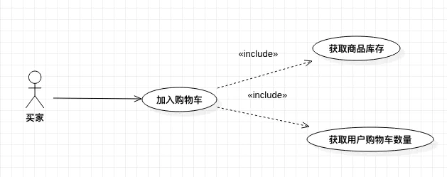

### 迭代开发

敏捷开发的核心就是迭代开发

**迭代开发将一个大任务，分解成多次连续的开发，本质就是逐步改进。**开发者先快速发布一个有效但不完美的最简版本，然后不断迭代。每一次迭代都包含**规划、设计、编码、测试、评估**五个步骤，不断改进产品，添加新功能。通过频繁的发布，以及跟踪对前一次迭代的反馈，最终接近较完善的产品形态。

#### 规划

##### 用例图

确定角色，确定每个角色的需要

| 卖家         | 买家         | 管理员       |
| ------------ | ------------ | ------------ |
| 订单         | 订单         | 订单         |
| 发布查看商品 | 搜索查看商品 | 管理商品     |
| 库存         | 购买历史     | 商品交易记录 |
| ....         | ...          | ...          |
|              |              |              |

#### 设计

产品原型图，UI图等

### 增量开发

**"增量开发"，指的是软件的每个版本，都会新增一个用户可以感知的完整功能。按照新增功能来划分迭代。**

> **增量开发加上迭代开发，才算真正的敏捷开发。**

### 敏捷开发优点

1. 早期交付
   1. 通过早期交付获得利润，降低一次性成本
2. 降低风险
   1. 在开发的过程中获得用户反馈，纠正功能不合理的地方
   2. 及时了解市场需求，降低产品不适用的风险

### 敏捷开发的价值观

[《敏捷开发宣言》](https://agilemanifesto.org/iso/zhchs/manifesto.html)里面提到四个价值观

1. **个体和互动** 高于 流程和工具
2. **工作的软件** 高于 详尽的文档
3. **客户合作** 高于 合同谈判
4. **响应变化** 高于 遵循计划

### 敏捷开发十二原则

1. 通过早期和持续交付有价值的软件，实现客户满意度。
2. 欢迎不断变化的需求，即使是在项目开发的后期。要善于利用需求变更，帮助客户获得竞争优势。
3. 不断交付可用的软件，周期通常是几周，越短越好。
4. 项目过程中，业务人员与开发人员必须在一起工作。
5. 项目必须围绕那些有内在动力的个人而建立，他们应该受到信任。
6. 面对面交谈是最好的沟通方式。
7. 可用性是衡量进度的主要指标。
8. 提倡可持续的开发，保持稳定的进展速度。
9. 不断关注技术是否优秀，设计是否良好。
10. 简单性至关重要，尽最大可能减少不必要的工作。
11. 最好的架构、要求和设计，来自团队内部自发的认识。
12. 团队要定期反思如何更有效，并相应地进行调整。

### [敏捷开发的过程](https://www.jianshu.com/p/9308a4cffaf7)

#### 梳理需求

需要遵循 INVEST 原则，即：

- Independent 独立的，尽量和其他需求没有依赖
- Negotiable 可讨价还价的
- Valuable 有价值的
- Estimable 可预估的
- Small 足够小，拆分到一个迭代内能完成
- Testable 可被测试的

#### 制定迭代计划

任务分为 未开始、进行中、已完成

团队成员根据需求的复杂程度评估每个任务的工作量

#### 迭代执行

这个过程可以使用燃尽图去进行表示

1. 我昨天做了什么
2. 今天计划要做什么
3. 遇到了哪些问题

#### 迭代总结

1. 成果展示环节。 要求团队成员在这个迭代中自己完成的任务展示给所有人看，除了团队内部所有成员以外，还可以邀请领导等关心项目进展的人。
2. 内部总结。 只在团队内部进行，总结这个迭代中做的好的地方以及不好的地方，接下来如何改进